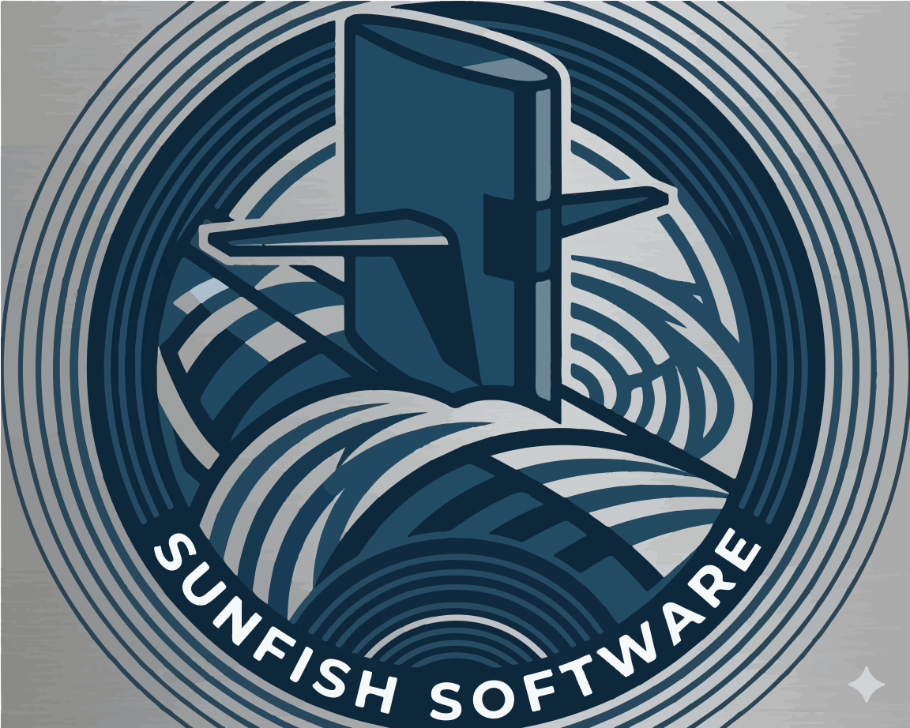

<p align="center">
  
</p>

# Sunfish

Sunfish is a framework‑agnostic suite of open‑source and commercial building blocks that lets you rapidly scaffold, prototype, and ship real-world applications with interchangeable UI and domain components.

## Why Sunfish?

- **Framework-agnostic**: Use the same primitives and patterns across Blazor, React, and other stacks via thin adapters.  
- **Prototype to production**: Start with open-source components for fast prototyping, then swap in commercial partners (like Telerik) or Sunfish premium modules without rewriting everything.  
- **Beyond components**: Sunfish includes domain‑level modules (forms, tasks, scheduling, asset management) so you assemble full features, not just UI widgets.  
- **Migration-friendly**: Design your app against stable abstractions so you can change underlying vendors with minimal surface‑area impact.

## Companion book — *The Inverted Stack*

The architectural choices in this repo trace back to a longer-form argument:
[**The Inverted Stack**](https://github.com/ctwoodwa/the-inverted-stack) — a
book on local-first SaaS, the kernel/plugin split, the trust model behind
hosted-node-as-SaaS deployments, and why the SaaS paradigm needs inverting.
Read it alongside the code to understand *why* Sunfish is structured the way
it is.

The repo's foundational paper
([`_shared/product/local-node-architecture-paper.md`](_shared/product/local-node-architecture-paper.md))
is the technical specification derived from the book; the book gives the
conceptual grounding (motivation, history, alternatives considered).

## High-level architecture

Sunfish is organized into layers:

- **Foundation**  
  Design tokens, utilities, and primitives shared across all packages.

- **UI Components**  
  Framework-agnostic component APIs plus adapters for specific UI frameworks.

- **Compatibility Kits**  
  Optional packages that mirror the public API shape of popular commercial libraries, so you can prototype against Sunfish and later switch vendors with minimal changes.

- **Blocks & Modules**  
  Higher-level building blocks such as dynamic forms, data grids, task boards, and schedulers that encapsulate patterns and cross-cutting logic.

- **Solution Accelerators**
  Opinionated, ready-to-extend starter solutions composed from Sunfish building blocks.
  [Bridge](accelerators/bridge/README.md) is the reference implementation — a
  **generic multi-tenant SaaS shell accelerator** that demonstrates the whole
  Sunfish stack end-to-end (Blazor Server, .NET Aspire, EF Core + Postgres,
  DAB, SignalR, Wolverine messaging). Bridge hosts **business-case bundles**;
  Property Management is its first reference bundle. See
  [ADR 0006](docs/adrs/0006-bridge-is-saas-shell.md) for the shell-vs-bundle
  split, [ADR 0007](docs/adrs/0007-bundle-manifest-schema.md) for bundle
  composition, and
  [accelerators/bridge/ROADMAP.md](accelerators/bridge/ROADMAP.md) +
  [accelerators/bridge/PLATFORM_ALIGNMENT.md](accelerators/bridge/PLATFORM_ALIGNMENT.md).

## Repository layout

```text
sunfish/
  packages/
    foundation/          # tokens, utilities, core contracts
    ui-core/             # framework-agnostic component contracts
    ui-adapters-blazor/  # Blazor adapter implementation
    ui-adapters-react/   # React adapter implementation
    compat-telerik/      # optional, API-compatible surface where permissible
    blocks-forms/        # dynamic form engine + helpers
    blocks-tasks/        # tasks, boards, status flows
    blocks-scheduling/   # calendars, resource scheduling
    blocks-assets/       # asset/catalog primitives
  apps/
    docs/                # documentation site + live examples
    kitchen-sink/        # playground for all components and blocks
  accelerators/
    bridge/              # Bridge — reference solution accelerator (full-stack PM app)
  tooling/
    scaffolding-cli/     # Sunfish CLI for scaffolding apps and modules
  _shared/
    design/              # component principles, token guidelines
    engineering/         # coding standards, package conventions, testing strategy
    product/             # vision, architecture principles, compatibility policy
  icm/                   # ICM pipeline — workflow artifacts only, not code
```

> The directory structure is scaffolded. Packages are being built incrementally as the design matures.

## Try the Kitchen Sink

The fastest way to see Sunfish in action:

```bash
dotnet run --project apps/kitchen-sink
```

Open https://localhost:5301 and browse the sidebar. Every Sunfish Blazor component has a demo page. The theme picker (top-right) switches providers and dark/light mode.

## Documentation

- **Published site:** https://ctwoodwa.github.io/sunfish/ (published via `.github/workflows/docs.yml` on merges to `main`)
- **Edit docs:** see [`apps/docs/README.md`](apps/docs/README.md) for local preview + edit workflow

## Example use cases

- Quickly prototype a line-of-business app using open-source Sunfish components, then selectively replace specific grids or charts with commercial equivalents.  
- Standardize UX across multiple applications by building against Sunfish contracts instead of directly against vendor-specific libraries.  
- Compose domain features like “asset management” or “project planning” from reusable Sunfish blocks and extend them with your own business rules.

## Status

Sunfish is in active early development. The repository structure and ICM pipeline are in place;
package implementations are being built incrementally.

APIs, package names, and structure are subject to change until a 1.0 release is tagged.

Planned milestones:

1. Foundation + core UI abstractions  
2. First framework adapter (likely Blazor)  
3. Forms + tasks blocks  
4. Initial solution accelerator (TBD domain)

## Contributing

Contributions, ideas, and discussion are very welcome—even at this early stage.

- Open an issue to propose new building blocks, adapters, or solution accelerators.  
- Share real-world scenarios where a compatibility or abstraction layer would simplify your stack.  
- Help refine the API design so Sunfish is pleasant to use from multiple frameworks.

### Development process

Sunfish uses an ICM (Integrated Change Management) pipeline to stage work from intake through release.
All changes flow through deliberate phases with review gates, keeping design decisions traceable.
See [`/icm/CONTEXT.md`](icm/CONTEXT.md) for an overview, and [`CLAUDE.md`](CLAUDE.md) for
AI-assisted development guidance including the tool boundaries between ICM, OpenWolf, and Serena.

## License

The core Sunfish packages will be released under an open-source license, with optional commercial add-ons for advanced modules, adapters, and enterprise support.

(Exact licensing details are still being finalized and will be documented here before the first public release.)
