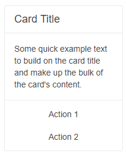
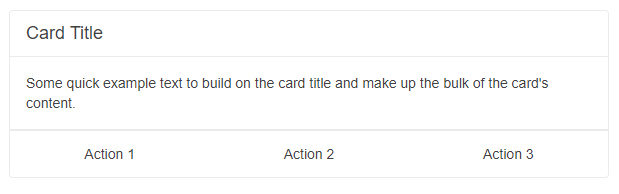

# Card Actions

Every Blazor Card can have a dedicated area for action buttons related to the content. The content of these action items, as well as their overall layout and orientation, is completely customizable through the available configuration options.

Sunfish Button components with the `k-flat` class are designed to fit in the card design as actions, so you can use them as your first choice of action components. You can find examples with them below.

#### In this article:
   * [Features](#features) 
   * [Orientation](#orientation)
   * [Layout](#layout)

## Features

>caption The Card provides the following features:

* `Class` - `string` - the CSS class that will be rendered on the main wrapping container of the action buttons.

* `Orientation` - `CardOrientation` - defines the orientation of the Action buttons.

* `Layout` - `CardActionsLayout` - defines the layout of the Action buttons.


## Orientation

You can define the orientation of the buttons through the `Orientation` parameter of the `CardActions`. It takes a member of the `Sunfish.Blazor.CardOrientation` enum:
   * `Horizontal` - the default
   * `Vertical`

>caption Change the orientation of the action buttons. The result from the snippet below.



````RAZOR
@* Change the orientation of the action buttons *@

<SunfishCard Width="200px">
    <CardHeader>
        <CardTitle>Card Title</CardTitle>
    </CardHeader>
    <CardBody>
        <p>Some quick example text to build on the card title and make up the bulk of the card content.</p>
    </CardBody>
    <CardSeparator></CardSeparator>
    
    <CardActions Orientation="@CardOrientation.Vertical">
        <SunfishButton Class="k-flat">Action 1</SunfishButton>
        <SunfishButton Class="k-flat">Action 2</SunfishButton>
    </CardActions>
    
</SunfishCard>
````


## Layout

You can set the layout of the action buttons through the `Layout` parameter of the `CardActions`. We support 4 types of layout - to the start, center, end part of the actions container, or stretched buttons that will fill the whole container with equal size.

The `Layout` parameter takes a member of the `Sunfish.Blazor.CardActionsLayout` enum:
* `Center` - the default
* `End`
* `Start`
* `Stretch`

>caption Set stretched layout for the action buttons. The result from the snippet below.



````RAZOR
@* Change the layout of the action buttons *@

<SunfishCard Width="600px">
    <CardHeader>
        <CardTitle>Card Title</CardTitle>
    </CardHeader>
    <CardBody>
        <p>Some quick example text to build on the card title and make up the bulk of the card content.</p>
    </CardBody>
    <CardSeparator></CardSeparator>
    
    <CardActions Layout="@CardActionsLayout.Stretch">
        <SunfishButton Class="k-flat">Action 1</SunfishButton>
        <SunfishButton Class="k-flat">Action 2</SunfishButton>
        <SunfishButton Class="k-flat">Action 3</SunfishButton>
    </CardActions>
    
</SunfishCard>
````

>tip Icon buttons in the CardActions area will expand horizontally and vertically, if the `Layout` is `Stretch` or if the `Orientation` is `Vertical`. If this is not desired, check this knowledge base article: [CardAction Icon Buttons Are Too Big](slug:card-kb-icon-buttons-too-large).

## See Also
  
  * [Live Demo: Card](https://demos.sunfish.dev/blazor-ui/card/actions)
  