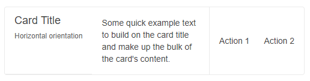
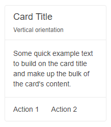

# Card Orientation

You can define the Card orientation by setting its `Orientation` parameter to a member of the `Sunfish.Blazor.CardOrientation` enum that provides the following options:

   * [`Horizontal`](#card-with-horizontal-orientation)

   * [`Vertical`](#card-with-vertical-orientation) - the default


## Card with Horizontal orientation

A Card with horizontal orientation. The result from the snippet below.



````RAZOR
@* Change the orientation of the Card *@

<SunfishCard Orientation="CardOrientation.Horizontal" Width="500px">
    <CardHeader>
        <CardTitle>Card Title</CardTitle>
        <CardSubTitle>Horizontal orientation</CardSubTitle>
    </CardHeader>
    <CardBody>
        <p>Some quick example text to build on the card title and make up the bulk of the card content.</p>
    </CardBody>
    <CardSeparator></CardSeparator>
    <CardActions>
        <SunfishButton Class="k-flat">Action 1</SunfishButton>
        <SunfishButton Class="k-flat">Action 2</SunfishButton>
    </CardActions>
</SunfishCard>
````


## Card with Vertical orientation

Vertical orientation is the default orientation of the Card, so you don't need to explicitly define it. The below snippet demonstrates how to specify it for example purposes.

The result from the snippet below.



````RAZOR
@* Change the orientation of the Card *@

<SunfishCard Orientation="CardOrientation.Vertical" Width="200px">
    <CardHeader>
        <CardTitle>Card Title</CardTitle>
        <CardSubTitle>Vertical orientation</CardSubTitle>
    </CardHeader>
    <CardBody>
        <p>Some quick example text to build on the card title and make up the bulk of the card content.</p>
    </CardBody>
    <CardSeparator></CardSeparator>
    <CardActions>
        <SunfishButton Class="k-flat">Action 1</SunfishButton>
        <SunfishButton Class="k-flat">Action 2</SunfishButton>
    </CardActions>
</SunfishCard>
````

## See Also

  * [Live Demo: Card Orientation](https://demos.sunfish.dev/blazor-ui/card/orientation)