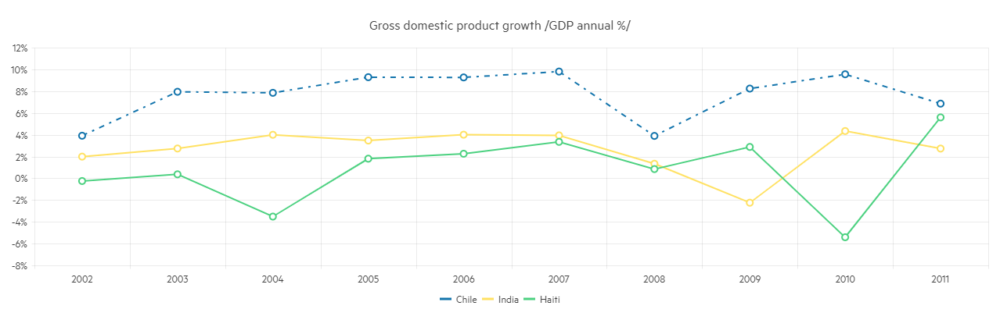

# Line Chart

The <a href="https://sunfish.dev/blazor-ui/line-chart" target="_blank">Blazor Line chart</a> displays data as continuous lines that pass through points defined by the values of their items. It is useful for rendering a trend over time and comparing several sets of similar data.



@[template](/_contentTemplates/chart/link-to-basics.md#understand-basics-and-databinding-first)

#### To create a line chart:

1. add a `ChartSeries` to the `ChartSeriesItems` collection
2. set its `Type` property to `ChartSeriesType.Line`
3. provide a data collection to its `Data` property
4. optionally, provide data for the x-axis `Categories`


>caption A line chart that shows product revenues

````RAZOR
Line series

<SunfishChart>
	<ChartSeriesItems>
		<SunfishChartSeries Type="ChartSeriesType.Line" Name="Product 1" Data="@series1Data">
		</SunfishChartSeries>
		<SunfishChartSeries Type="ChartSeriesType.Line" Name="Product 2" Data="@series2Data">
		</SunfishChartSeries>
	</ChartSeriesItems>

	<ChartCategoryAxes>
		<ChartCategoryAxis Categories="@xAxisItems"></ChartCategoryAxis>
	</ChartCategoryAxes>

	<ChartTitle Text="Quarterly revenue per product"></ChartTitle>

	<ChartLegend Position="ChartPosition.Right">
	</ChartLegend>
</SunfishChart>

@code {
	public List<object> series1Data = new List<object>() { 10, 2, 5, 6 };
	public List<object> series2Data = new List<object>() { 5, 8, 2, 7 };
	public string[] xAxisItems = new string[] { "Q1", "Q2", "Q3", "Q4" };
}
````


## Line Chart Specific Appearance Settings

@[template](/_contentTemplates/chart/link-to-basics.md#markers-line-scatter)

@[template](/_contentTemplates/chart/link-to-basics.md#color-line-scatter)


### Missing Values

If some values are missing from the series data (they are `null`), you can have the chart work around this by setting the `MissingValues` property of the series to the desired behavior (member of the `Sunfish.Blazor.ChartSeriesMissingValues` enum):

* `Zero` - the default behavior. The line goes to the 0 value mark.
* `Interpolate` - the line will go through the interpolated value of the missing data points and connect to the next data point with a value.
* `Gap` - there will be no line for the category that misses a value.


@[template](/_contentTemplates/chart/link-to-basics.md#line-style-line)

@[template](/_contentTemplates/chart/link-to-basics.md#configurable-nested-chart-settings)

@[template](/_contentTemplates/chart/link-to-basics.md#configurable-nested-chart-settings-categorical)

>caption A line chart that shows how to rotate the labels

````RAZOR
@* Change the rotation angle of the Labels *@

<SunfishChart>
    <ChartSeriesItems>
        <SunfishChartSeries Type="ChartSeriesType.Line" Name="Product 1" Data="@series1Data">
        </SunfishChartSeries>
        <SunfishChartSeries Type="ChartSeriesType.Line" Name="Product 2" Data="@series2Data">
        </SunfishChartSeries>
    </ChartSeriesItems>

    <ChartCategoryAxes>
        <ChartCategoryAxis Categories="@xAxisItems">
            <ChartCategoryAxisLabels>
                <ChartCategoryAxisLabelsRotation Angle="-45" />
            </ChartCategoryAxisLabels>
        </ChartCategoryAxis>
    </ChartCategoryAxes>

    <ChartTitle Text="Quarterly revenue per product"></ChartTitle>

    <ChartLegend Position="ChartPosition.Right">
    </ChartLegend>
</SunfishChart>

@code {
    public List<object> series1Data = new List<object>() { 10, 2, 5, 6 };
    public List<object> series2Data = new List<object>() { 5, 8, 2, 7 };
    public string[] xAxisItems = new string[] { "Q1", "Q2", "Q3", "Q4" };
}
````


## See Also

  * [Live Demo: Line Chart](https://demos.sunfish.dev/blazor-ui/chart/line-chart)
