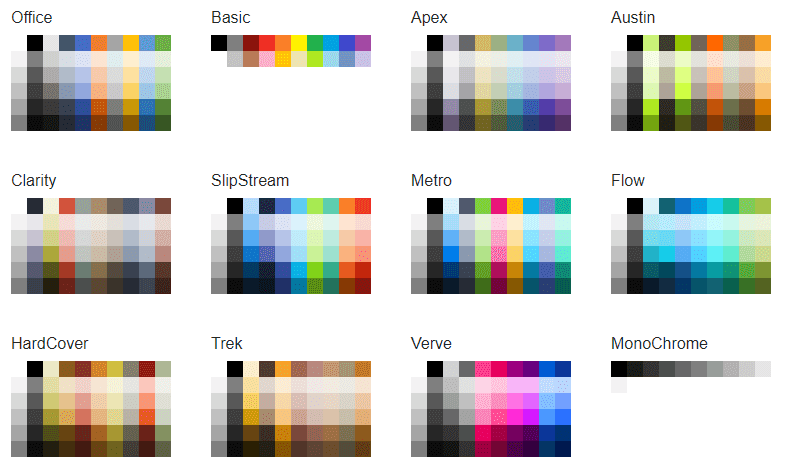

# Predefined Colors

The Sunfish Blazor Color Palette component comes with a set of predefined color sets that you can show your users. To use them, set its `Colors` parameter to one of the members of the `Sunfish.Blazor.Components.ColorPalettePresets` static class.

>caption Example of using a predefined color list

````RAZOR
@SelectedColor
<SunfishColorPalette Colors="@ColorPalettePresets.Basic" @bind-Value="@SelectedColor" />
@code{
    string SelectedColor { get; set; }
}
````

>caption List of the built-in color presets in the Sunfish Color Palette



>caption Explore the predefined color presets - generates the image above

````RAZOR
<div style="display:flex;flex-direction: row; flex-flow:wrap;">
    @foreach (System.Reflection.FieldInfo item in typeof(ColorPalettePresets).GetFields())
    {
        List<string> currPreset = (List<string>)item.GetValue(null);
        string presetName = item.Name;
        <div style="padding: 20px;">
            <h6>@presetName</h6>
            <SunfishColorPalette Colors="@currPreset" TileHeight="16px" TileWidth="16px" />
        </div>
    }
</div>
````


## See Also

* [Color Palette Overview](slug:colorpalette-overview)
* [Custom Color Lists](slug:colorpalette-custom-colors)
