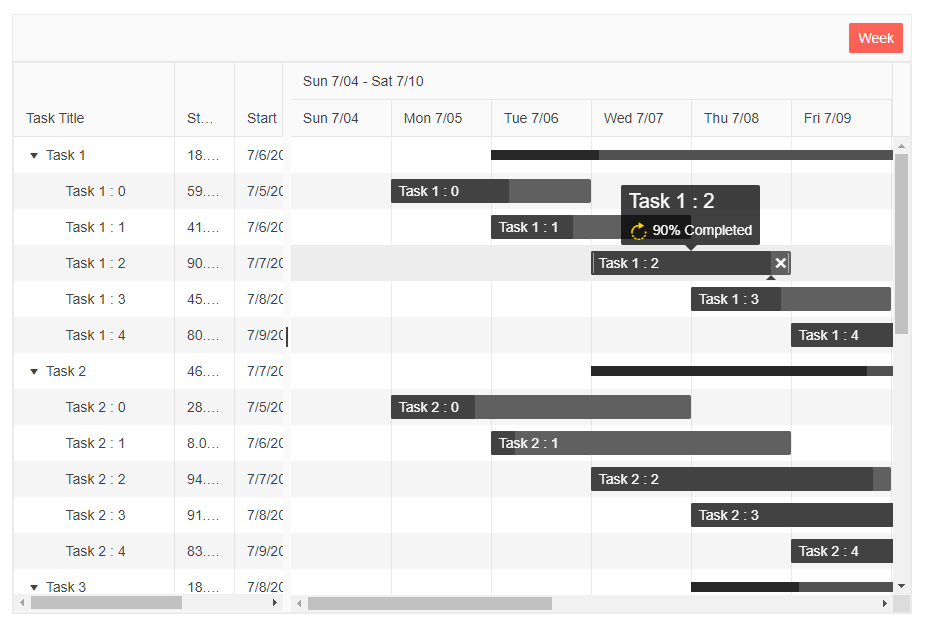

# TooltipTemplate

The `TooltipTemplate` provides you with full control over the rendering of the Timeline Task Tooltips.

The `TooltipTemplate` is of type `RenderFragment<TItem>`, so the `context` has the datatype of the model. The tooltip template receives the strongly-typed TItem directly. No casting is needed.

<div class="skip-repl"></div>

````RAZOR
    <TooltipTemplate>
        <h4>@context.Title</h4>
        <h5>Percent Complete: @(context.PercentComplete * 100)%</h5>
        <h5>Start: @context.Start.ToShortDateString()</h5>
        <h5>End: @context.End.ToShortDateString()</h5>
    </TooltipTemplate>
````

Apart from that, you can add and customize any other content - for example, icons, images, components etc.

>caption Customize the Task Tooltip through the `TooltipTemplate`. The result from the snippet after hovering Task 1:2.




````RAZOR
@* Customize the content of the Tooltip through the TooltipTemplate *@

<SunfishGantt Data="@Data"
              Width="900px"
              Height="600px"
              IdField="Id"
              ParentIdField="ParentId"
              OnUpdate="@UpdateItem"
              OnDelete="@DeleteItem">
    <TooltipTemplate>
            <h5>@context.Title</h5>
            <SunfishSvgIcon Class="status" Icon="@SvgIcon.Rotate"></SunfishSvgIcon>
            @(context.PercentComplete * 100)% Completed
        <br />
    </TooltipTemplate>
    <GanttColumns>
        <GanttColumn Field="Title"
                     Expandable="true"
                     Width="160px"
                     Title="Task Title">
        </GanttColumn>
        <GanttColumn Field="PercentComplete"
                     Title="Status"
                     Width="60px"
                     DisplayFormat="{0:P}">
        </GanttColumn>
        <GanttColumn Field="Start"
                     Width="100px"
                     DisplayFormat="{0:d}">
        </GanttColumn>
        <GanttColumn Field="End"
                     Width="100px"
                     DisplayFormat="{0:d}">
        </GanttColumn>
    </GanttColumns>
    <GanttViews>
        <GanttWeekView></GanttWeekView>
    </GanttViews>
</SunfishGantt>

@code {
    List<FlatModel> Data { get; set; }

    class FlatModel
    {
        public int Id { get; set; }
        public int? ParentId { get; set; }
        public string Title { get; set; }
        public double PercentComplete { get; set; }
        public DateTime Start { get; set; }
        public DateTime End { get; set; }
    }

    public int LastId { get; set; } = 1;

    protected override void OnInitialized()
    {
        Data = new List<FlatModel>();
        var random = new Random();

        for (int i = 1; i < 6; i++)
        {
            var newItem = new FlatModel()
            {
                Id = LastId,
                Title = "Task  " + i.ToString(),
                Start = new DateTime(2021, 7, 5 + i),
                End = new DateTime(2021, 7, 11 + i),
                PercentComplete = Math.Round(random.NextDouble(), 2)
            };

            Data.Add(newItem);
            var parentId = LastId;
            LastId++;

            for (int j = 0; j < 5; j++)
            {
                Data.Add(new FlatModel()
                {
                    Id = LastId,
                    ParentId = parentId,
                    Title = "    Task " + i + " : " + j.ToString(),
                    Start = new DateTime(2021, 7, 5 + j),
                    End = new DateTime(2021, 7, 6 + i + j),
                    PercentComplete = Math.Round(random.NextDouble(), 2)
                });

                LastId++;
            }
        }

        base.OnInitialized();
    }

    private void UpdateItem(GanttUpdateEventArgs args)
    {
        var item = args.Item as FlatModel;

        var foundItem = Data.FirstOrDefault(i => i.Id.Equals(item.Id));

        if (foundItem != null)
        {
            foundItem.Title = item.Title;
            foundItem.Start = item.Start;
            foundItem.End = item.End;
            foundItem.PercentComplete = item.PercentComplete;
        }
    }

    private void DeleteItem(GanttDeleteEventArgs args)
    {
        var item = Data.FirstOrDefault(i => i.Id.Equals((args.Item as FlatModel).Id));

        RemoveChildRecursive(item);
    }

    private void RemoveChildRecursive(FlatModel item)
    {
        var children = Data.Where(i => item.Id.Equals(i.ParentId)).ToList();

        foreach (var child in children)
        {
            RemoveChildRecursive(child);
        }

        Data.Remove(item);
    }
}

<style>
    .status {
        color: gold;
        padding: 4px;
        font-size: 20px;
    }
</style>
````

## See Also

  * [Live Demo: Gantt Templates](https://demos.sunfish.dev/blazor-ui/gantt/templates)
