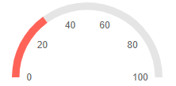
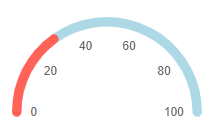
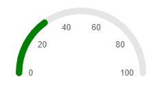
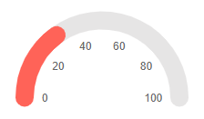

# Arc Gauge Pointers

The pointers are the values that will be marked on the scale. You can customize them through the parameters they expose:

* [LineCap](#linecap)

* [PlaceholderColor](#placeholdercolor)

* [Color](#color)

* [Size](#size)

## LineCap

The `LineCap` parameter controls the shape of the scale ending and takes a member of the `ArcGaugePointerLineCap` enum:

* `Round` - by default the shape of the scale ending would be round

* `Butt` - setting the ArcGaugePointerLineCap to Butt would make the shape of the scale ending flat. 

>caption Change the shape of the scale. The result from the code snippet below.



````RAZOR
@* Use a flat shape for the end of the scale *@

<SunfishArcGauge>
    <ArcGaugeScales>
        <ArcGaugeScale>
            <ArcGaugeScaleLabels Visible="true" />
        </ArcGaugeScale>
    </ArcGaugeScales>

    <ArcGaugePointers>

        <ArcGaugePointer Value="30" LineCap="@ArcGaugePointerLineCap.Butt">
        </ArcGaugePointer>

    </ArcGaugePointers>
</SunfishArcGauge>
````

## PlaceholderColor

The `PlaceholderColor` (`string`) parameter controls the background color of the pointer. It accepts **CSS**, **HEX** and **RGB** colors.

>caption Change the background color of the pointer. The result from the code snippet below:



````RAZOR
@* Set the PlaceholderColor to light blue *@

<SunfishArcGauge>
    <ArcGaugeScales>
        <ArcGaugeScale>
            <ArcGaugeScaleLabels Visible="true" />
        </ArcGaugeScale>
    </ArcGaugeScales>

    <ArcGaugePointers>

        <ArcGaugePointer Value="30" PlaceholderColor="lightblue">
        </ArcGaugePointer>

    </ArcGaugePointers>
</SunfishArcGauge>
````

## Color

The `Color` (`string`) parameter controls the color of the pointer. It accepts **CSS**, **HEX** and **RGB** colors.

>caption Change the color of the pointer. The result from the code snippet below



````RAZOR
@* Change the color of the pointer to green *@

<SunfishArcGauge>
    <ArcGaugeScales>
        <ArcGaugeScale>
            <ArcGaugeScaleLabels Visible="true" />
        </ArcGaugeScale>
    </ArcGaugeScales>

    <ArcGaugePointers>

        <ArcGaugePointer Value="30" Color="green">
        </ArcGaugePointer>

    </ArcGaugePointers>
</SunfishArcGauge>
````

## Size

The `Size` (`double`) parameter controls the size of the pointer. 



````RAZOR
@* Change the sizes of the pointer *@ 

<SunfishArcGauge>
    <ArcGaugeScales>
        <ArcGaugeScale>
            <ArcGaugeScaleLabels Visible="true" />
        </ArcGaugeScale>
    </ArcGaugeScales>

    <ArcGaugePointers>

        <ArcGaugePointer Value="30" Size="20">
        </ArcGaugePointer>

    </ArcGaugePointers>
</SunfishArcGauge>
````

## See Also

* [Live Demo: Arc Gauge](https://demos.sunfish.dev/blazor-ui/arcgauge/overview)
* [Arc Gauge: Overview](slug:arc-gauge-overview)
* [Arc Gauge: Scale](slug:arc-gauge-scale)
