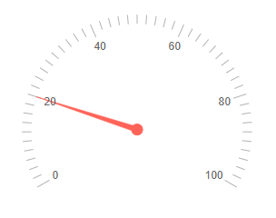

# Blazor Radial Gauge Overview

The <a href = "https://sunfish.dev/blazor-ui/radial-gauge" target="_blank">Sunfish Radial Gauge for Blazor</a> represents numerical values on a [scale](slug:radial-gauge-scale) of ranges in a radial format.

## Creating Radial Gauge

1. Add the `<SunfishRadialGauge>` tag to your razor page.
1. Add one or more instances of the `<RadialGaugePointer>` to the `<RadialGaugePointers>` collection.
1. Provide a `Value` for each `<RadialGaugePointer>`.

>caption Basic Sunfish Radial Gauge for Blazor.



````RAZOR
@* Setup a basic radial gauge *@

<SunfishRadialGauge>
    <RadialGaugePointers>
        <RadialGaugePointer Value="20">            
        </RadialGaugePointer>        
    </RadialGaugePointers>    
</SunfishRadialGauge>
````

## Scale

The scale of the Radial Gauge renders the values of the [pointers](slug:radial-gauge-pointers), the [labels](slug:radial-gauge-labels), and different [ranges](slug:radial-gauge-ranges). [See the Scale article for more information...](slug:radial-gauge-scale)

## Pointers

The distinct values on the scale of the Radial Gauge. [See the Pointers article for more information...](slug:radial-gauge-pointers)

## Ranges

You can use the ranges to visually distinguish multiple pointers from the others on the scale. [See the Ranges article for more information...](slug:radial-gauge-ranges)

## Labels

The labels are rendered on the scale of the Radial Gauge to give information to the users about the value of the pointers. [See the Labels article for more information...](slug:radial-gauge-labels)

## Radial Gauge Parameters

@[template](/_contentTemplates/common/parameters-table-styles.md#table-layout)

| Parameter | Type and Default value | Description |
|-----------|------------------------|-------------|
| `Width`  | `string` | Controls the width of the component. |
| `Height`  | `string` | Controls the height of the component. |
| `Class`  | `string` | renders a custom CSS class on the `<div class="k-gauge">` element. You can use that class to reposition the component on the page. |
| `Transitions` | `bool?` | Controls if the Radial Gauge uses animations for its value changes. |
| `RenderAs` | `RenderingMode?` <br /> (`SVG`) | Controls if the gauge renders as `SVG` or `Canvas`. |

## Radial Gauge Reference and Methods

To execute Radial Gauge methods, obtain reference to the component instance via `@ref`.

| Method  | Description |
|---------|-------------|
| Refresh | You can use that method to programmatically re-render the component.    |


>caption Get a component reference and use the Refresh method

````RAZOR
@* Change the Height of the component *@

<SunfishButton OnClick="@ChangeHeight">Change the height</SunfishButton>

<SunfishRadialGauge @ref="@RadialGaugeRef" Height="@Height">
    <RadialGaugePointers>
        <RadialGaugePointer Value="20">
        </RadialGaugePointer>
    </RadialGaugePointers>
</SunfishRadialGauge>

@code{
    Sunfish.Blazor.Components.SunfishRadialGauge RadialGaugeRef { get; set; }

    public string Height { get; set; } = "200px";

    async Task ChangeHeight()
    {
        Height = "400px";

        //give time to the framework and browser to resize the actual DOM so the gauge can use the expected size
        await Task.Delay(30);

        RadialGaugeRef.Refresh();
    }
}
````

## See Also

* [Live Demo: Radial Gauge](https://demos.sunfish.dev/blazor-ui/radialgauge/overview)
