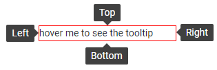

# Tooltip Position

The Tooltip component lets you define the location of its popup according to its target element.

You can control it through the `Position` parameter, which takes a member of the `Sunfish.Blazor.TooltipPosition` enum:
* `Top` - the default value
* `Bottom`
* `Right`
* `Left`

>caption The possible positions of the tooltip relative to its target



>caption Explore the possible tooltip positions

````RAZOR
@* Setting a position is not mandatory, it defaults to Top *@

<select @bind=@position>
    @foreach (var item in Enum.GetValues(typeof(TooltipPosition)))
    {
        <option value=@item>@item</option>
    }
</select>

<SunfishTooltip TargetSelector="#target" Position="@position">
</SunfishTooltip>

<div id="target" title="@position">hover me to see the tooltip</div>

@code {
    TooltipPosition position { get; set; } = TooltipPosition.Top;
}

<style>
    #target {
        margin: 200px;
        width: 200px;
        border: 1px solid red;
    }
</style>
````

## Next Steps

* [Choose a Tooltip Show Event](slug:tooltip-show-event)
* [Explore ToolTip Templates](slug:tooltip-template)

## See Also

* [Blazor Tooltip Overview](slug:tooltip-overview)
* [Live Demo: Tooltip Position](https://demos.sunfish.dev/blazor-ui/tooltip/position)
