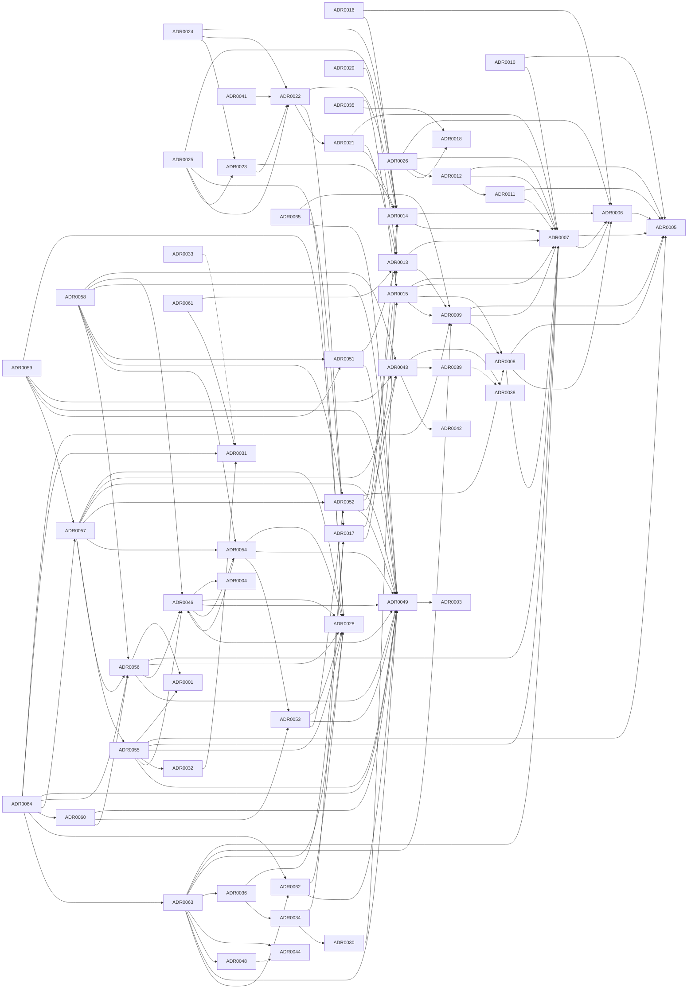

# ADR Dependency Graph

_Auto-generated from frontmatter by `tools/adr-projections/project.py`. Do not edit by hand._

Edges:
- `composes` (X uses Y's contracts) — solid arrow
- `extends` (X adds to Y) — dashed arrow
- `supersedes` (X replaces Y) — bold arrow

