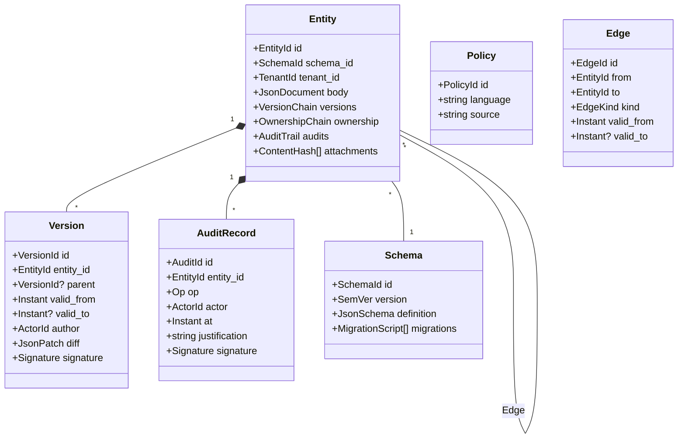

# Sunfish Platform Specification

**Document type:** Strategic platform specification
**Audience:** Architects, senior engineers, product leadership, executive stakeholders, partner ecosystem
**Status:** Draft v0.4 — strategic context document (tactical execution tracked in `/docs/superpowers/plans/`)
**Last updated:** 2026-04-18

**v0.4 changes** — multi-platform host strategy pivot. React adapter dropped; Blazor MAUI Hybrid adopted as the single component surface across web, desktop, and mobile. New Phase 2.5 (multi-platform host family) inserted in the roadmap. `ui-core` gains six opt-in contracts derived from Iced (Rust GUI library) lessons learned. Full detail in **Appendix E** and companion research note `docs/specifications/research-notes/multi-platform-host-evaluation.md`. Summary:
- §2.3 package architecture revised — `ui-adapters-react` removed; `Sunfish.Hosts.*` family added (web, desktop-maui, desktop-photino, mobile-maui, native-maui).
- §4.4 Phase 2 deliverable list — React adapter item removed; host-family cross-reference added.
- §4.5 — NEW — Phase 2.5 Multi-Platform Host Family inserted between current Phase 2 (asset modeling) and Phase 3 (workflow orchestration); section numbers below shift accordingly.
- §4.10 item 7 — "React adapter absent" gap reframed as "multi-platform hosts not yet shipped; Blazor MAUI Hybrid is the strategy".
- Appendix C open questions #5 and #6 closed; #5 slot reclaimed for edge/embedded-device UX as a deferred follow-up (Iced-in-Rust is the candidate there).
- Adoption of six Iced lessons as opt-in `ui-core` contracts (non-breaking, additive): `ISunfishRenderer`, `IClientTask<TMessage>` / `IClientSubscription<TMessage>`, per-widget `Style` records, `StateMachineComponent<TState, TMessage>`, `ISunfishOperation`, `SunfishElement<TMessage>`.
- OSS gap-filler catalog codified in the research note: Fluxor (state mgmt), CommunityToolkit.Maui (native interop), Shiny.NET (push), SQLite-net-pcl (offline storage), Axe-core-blazor (a11y CI), Photino.Blazor (lightweight desktop shell), MudBlazor / Radzen.Blazor / Blazorise (data-grid depth).

**v0.3 changes** — reconciliation pass applied after Platform Phases A / B-blobs / B / C / D shipped in consolidation PR #8. Eighteen tensions between v0.2 spec and the implementation-bound plan artifacts were surfaced during phase execution; each is addressed below with a "v0.3 note" in the affected section, and the full list is captured in **Appendix D — v0.3 Revisions Applied from Shipped Platform Phases**. Summary:
- §2.4 + §10.2 — canonical-JSON coverage requires string-shaped identity fields; `PrincipalId` and `Signature` now carry JsonConverter round-trippers.
- §2.5 — federation shipped at the entity level via signed-envelope + head-announcement + change-exchange protocol; spec cross-references the shipped `SyncEnvelope` and `ChangeRecord` shapes.
- §3.1 + §3.2 + §3.3 — Version DTO shape clarified (structured `VersionId(Entity, Sequence, Hash)`); `AuditAppend` write operation distinguished from `AuditRecord` read shape; `CreateAsync` idempotency rule stated.
- §3.5 — `Action` renamed to `ActionType` to avoid `System.Action` collision; Obligations are caller-fulfilled (standardized sinks are future work); policy-language fluent API is the shipped authoring surface (parser targets the same `PolicyModel` when added).
- §3.5 + §10.2 — capability-graph and ReBAC tuple-store are independent primitives; application-layer write-through documented.
- §3.7 + §7 — blob-boundary threshold pinned at 64 KiB default with per-schema override hint.
- §8 — hierarchy uses closure-table materialization (vs adjacency list); `SupersededBy` edge semantics on Split added.
- §10.2.1 — group `PrincipalId` derivation specified (KeyPair-derived or SHA-256 of MintPrincipal op's canonical JSON).
- §10.2.2 — macaroon `IRootKeyStore` contract names the key-ring primitive.
- §10.4 — three canonical federation patterns (PM + city, base command + air-gap, contractor portal + macaroon) ship as worked examples; Pattern C is code-ready, A/B gated on IPFS blob-replication (follow-up issues #10, #11).

**v0.2 changes:**
- §10.2 delegation model revised from Macaroon-primary to Keyhive-inspired group-membership (primary) + Macaroon-style tokens (supplementary). Driven by research in `docs/specifications/research-notes/automerge-evaluation.md`.
- §3 kernel primitives expanded from 6 to 7 with the addition of **§3.7 Blob Store** — content-addressed binary storage keyed by CID. Driven by research in `docs/specifications/research-notes/ipfs-evaluation.md`. Positions IPFS + IPFS-Cluster as candidate federation backends; `FileSystemBlobStore` remains the single-node default.
- Collectively: the platform now has a clearer split between structured-entity (Automerge-style CRDT + Keyhive capability), binary-blob (IPFS-style CID addressing), and policy (PolicyL DSL on top of Keyhive). The research notes in `docs/specifications/research-notes/` are the detailed sources:
  - `automerge-evaluation.md` — CRDT entity store + Keyhive capability model
  - `ipfs-evaluation.md` — content-addressed blob store (spec §3.7)
  - `external-references.md` — catalog of prior art across forms, workflow, authorization, schema, BIM (cross-cuts §3.4, §3.5, §3.6, §6, §7, §9, §10, Phase 5)

---

## Table of Contents

1. [Executive Summary](#1-executive-summary)
2. [Reference Architecture](#2-reference-architecture)
3. [Core Kernel Specification](#3-core-kernel-specification)
4. [Phased Implementation Roadmap](#4-phased-implementation-roadmap)
5. [Technical Specifications](#5-technical-specifications)
6. [Property Management MVP Feature Set](#6-property-management-mvp-feature-set)
7. [Input Modalities](#7-input-modalities)
8. [Asset Evolution and Versioning Strategy](#8-asset-evolution-and-versioning-strategy)
9. [BIM Integration Approach](#9-bim-integration-approach)
10. [Multi-Jurisdictional and Multi-Tenant Design](#10-multi-jurisdictional-and-multi-tenant-design)
11. [Container and Deployment Guide](#11-container-and-deployment-guide)
12. [Risk Assessment and Mitigation](#12-risk-assessment-and-mitigation)
13. [Go-to-Market and Competitive Positioning](#13-go-to-market-and-competitive-positioning)

---

## 1. Executive Summary

### 1.1 What Sunfish Is

Sunfish is a **framework-agnostic suite of open-source and commercial building blocks** for rapidly constructing **asset management and workflow automation systems**. It is neither a single vertical SaaS product nor a low-code platform in the traditional sense. It is a **kernel plus an extensible library of composable primitives** — entities, workflows, forms, delegations, inspections, audit trails — that different organizations can assemble into radically different shapes while sharing the same underlying substrate.

At the heart of Sunfish is a simple but powerful idea: **the things organizations manage (assets, inspections, maintenance records, deficiencies, lease agreements, work orders, sensor readings) are first-class primitives**, not application-specific tables or framework-specific objects. Each primitive has:

- **Identity** — a cryptographically verifiable, globally unique handle
- **Versioning** — full history of every state transition, with the ability to query any point in time
- **Audit trail** — who did what, when, with what justification, signed by whom
- **Permissions** — multi-tenant, multi-jurisdictional, time-bound, delegable
- **Configurable workflows** — state machines and business rules defined declaratively, not hard-coded

A property management company, a military installation, a healthcare system, and a subway authority all use the **same kernel primitives**. What differs is how they compose them — the entity schemas they register, the workflows they configure, the federation boundaries they establish, and the UI surface they expose to their operators.

### 1.2 Market Opportunity

The enterprise asset management (EAM) and workflow automation markets are enormous but fractured:

| Segment | Estimated TAM (2026) | Dominant vendors | Key pain |
|---|---|---|---|
| Enterprise Asset Management | $8.5B | IBM Maximo, SAP EAM, Oracle EAM | Legacy, expensive, rigid schemas |
| Facilities / CMMS | $6.2B | FM:Systems, Archibus, UpKeep | Siloed, weak compliance, limited delegation |
| Property management software | $5.1B | AppFolio, Yardi, RealPage | Vertical-locked, no cross-jurisdiction federation |
| Workflow / BPM / case management | $18B | Pega, Appian, ServiceNow, Camunda | Proprietary runtimes, per-seat economics, high lock-in |
| Construction / project collaboration | $3.4B | Oracle Aconex, Procore, Autodesk | Project-scoped; weak for long-lived operations |
| Blockchain-enabled asset registries | $0.9B (nascent) | Propy, Fluree, various L1/L2 projects | Immature UX, narrow use cases |

These categories **overlap at the edges but do not share primitives**. A property manager using Yardi cannot share inspection data with a code enforcement agency using an Appian workflow. A subway authority's EAM records cannot be cross-referenced against a construction contractor's Aconex project without expensive integration work. Each vertical ships its own copy of essentially the same kernel — entities, states, audits, delegations — wrapped in vendor-specific skins.

Sunfish's market thesis: **the kernel should be open, federated, and identical across verticals; the verticalization lives in configuration and composition, not in the substrate.**

### 1.3 Positioning Statement

> **Sunfish is the open, federated kernel for asset and workflow systems — the substrate on which vertical operators, property managers, and infrastructure stewards build interoperable systems of record.**

Sunfish is to asset management what Linux is to operating systems: a shared kernel that hundreds of vertical distributions can sit on top of, each tailored to its domain but all interoperable at the primitive level.

### 1.4 Value Proposition by Audience

| Audience | Value |
|---|---|
| **Property management operator** | Ship a fully-featured PM system in weeks using the Bridge accelerator; own your data; federate inspections with contractors without vendor gateways |
| **Facility / infrastructure steward** | Model assets with full temporal history; survive schema evolution (a "building" becoming "two buildings"); pass audits with cryptographic trails |
| **Government / regulator** | Receive inspection and compliance reports from regulated entities via federation without mandating a specific vendor; verify cryptographic chain-of-custody |
| **Systems integrator / consultancy** | Build verticalized solution accelerators on top of Sunfish; charge for domain expertise, not plumbing |
| **Enterprise architect** | Single substrate for disparate domains (properties, vehicles, equipment, IT assets) with uniform audit and permission semantics |
| **Developer** | Framework-agnostic contracts implemented by the Blazor adapter, rendered across web / desktop / mobile via the `Sunfish.Hosts.*` family (Blazor MAUI Hybrid + Photino); extend the kernel via well-defined extension points; no proprietary runtime |
| **Executive** | Lower TCO vs. Maximo/ServiceNow class systems; avoid vendor lock-in via OSS kernel; defensible data sovereignty story |

### 1.5 Why Now

Three forces make 2026–2028 the right window for Sunfish:

1. **Regulatory pressure on data portability and auditability.** EU Data Act, US state-level right-to-audit laws, and industry-specific compliance regimes (HIPAA, NERC-CIP, DoD UFC 3-701-01) increasingly demand cryptographically verifiable audit trails and the ability to export and federate records. Closed-vertical vendors cannot match this natively.
2. **Maturity of decentralized primitives.** Content-addressed storage (IPFS), delegation tokens (Macaroons), decentralized identity (Solid, W3C DID), and permissioned ledgers (Hyperledger Fabric) are now production-grade. Sunfish is the first integrated application-layer substrate that composes them into a coherent kernel.
3. **LLM-era data interchange.** Large language models are unlocking sensor fusion, voice-to-entity capture, drone imagery analysis, and automated report generation. Organizations need a **canonical entity+event stream** these tools can write into. Sunfish provides it.

### 1.6 High-Level Differentiation

| Capability | Sunfish | Maximo | Pega/Appian | ServiceNow | Aconex | Property SaaS (Yardi/AppFolio) |
|---|---|---|---|---|---|---|
| Open-source kernel | ✓ | ✗ | ✗ | ✗ | ✗ | ✗ |
| Multi-platform UI (Blazor MAUI Hybrid across web + desktop + mobile) | ✓ | ✗ | ✗ | ✗ | ✗ | ✗ |
| Cryptographic ownership proofs | ✓ | ✗ | ✗ | ✗ | ✗ | ✗ |
| Federated authority (no central server) | ✓ | ✗ | ✗ | ✗ | partial | ✗ |
| Multi-vertical primitives | ✓ | partial | ✓ (generic BPM) | partial | ✗ | ✗ |
| Time-bound delegation (Macaroon-style) | ✓ | ✗ | ✗ | ✗ | ✗ | ✗ |
| Full temporal versioning of entities | ✓ | partial | ✗ | partial | ✗ | ✗ |
| Content-addressed document storage | ✓ | ✗ | ✗ | ✗ | ✗ | ✗ |
| Composable verticals (accelerators) | ✓ | ✗ | via apps | via apps | ✗ | ✗ |
| BIM integration (optional) | ✓ | ✗ | ✗ | ✗ | ✓ | ✗ |
| Low-code form designer | planned | ✗ | ✓ | ✓ | ✗ | ✗ |

### 1.7 Executive Summary in One Paragraph

Sunfish is an open-source kernel and a set of composable building blocks for asset management and workflow automation. Unlike vertical SaaS products (Yardi, Maximo) or proprietary workflow platforms (Pega, ServiceNow), Sunfish exposes **minimal, stable primitives** — entities with cryptographic identity, temporal versioning, federated permissions, delegated authority, and event streams — that different verticals compose differently. The first commercial accelerator, **Bridge**, packages these primitives as a full property management system. The same primitives underpin planned accelerators for military base maintenance, transit system inspections, school district facilities, and healthcare asset tracking. Sunfish's bet: the substrate should be open and shared; the value is in domain composition, federated interoperability, and audit-grade trust — not in re-implementing entity storage for the thousandth time.

---

## 2. Reference Architecture

### 2.1 Architectural Principles

Sunfish's architecture is governed by seven principles, each chosen to make the kernel survive decades of use across verticals:

1. **Minimal kernel.** The kernel owns six concerns — entity storage, versioning, audit, schema, permissions, events — and nothing else. Workflows, forms, UI, domain logic, and verticalization all extend the kernel; none of them live inside it.
2. **Framework-agnostic contracts.** Every kernel contract and every composable building block is defined in framework-agnostic C# (the `foundation` and `ui-core` packages). The Blazor adapter implements the contracts; hosts (`Sunfish.Hosts.Web`, `.Desktop.Maui`, `.Desktop.Photino`, `.Mobile.Maui`) render the same components across web, desktop, and mobile via Blazor MAUI Hybrid. The contracts do not privilege any single renderer — `ISunfishRenderer` (v0.4) is the extension point for future native-widget backends (Avalonia, pure MAUI XAML, Uno Platform).
3. **Decentralized governance with cryptographic proofs.** Ownership and authority are not centrally recorded. Each entity carries a cryptographic chain of custody that any participant can verify without calling a central server.
4. **Federated authority.** The kernel does not require a single validation server. A landlord's Sunfish node and a code-enforcement agency's Sunfish node can exchange inspection records and verify them independently.
5. **Temporal by default.** Every entity is versioned; every edge in the asset hierarchy is time-bounded; every query can be asked "as of" a historical point.
6. **Content-addressed immutable documents.** Attached artifacts (photos, PDFs, sensor CSV dumps, drone tiles) are stored by hash. The entity references the hash; storage backends (local, S3, IPFS) are pluggable.
7. **Core kernel approach.** Everything that is not a kernel concern lives outside the kernel. This includes workflows (which are extensions), domain blocks, UI, and verticalization.

### 2.2 System Context Diagram

```
                        ┌─────────────────────────────────────────┐
                        │          External actors                │
                        │  (users, sensors, drones, LLMs, other   │
                        │   Sunfish nodes, regulators, vendors)   │
                        └──────────────────┬──────────────────────┘
                                           │
                        ┌──────────────────▼──────────────────────┐
                        │         Ingestion / API surface         │
                        │   REST / GraphQL / SignalR / MQTT /     │
                        │   CoAP / S3-compatible uploads          │
                        └──────────────────┬──────────────────────┘
                                           │
    ┌──────────────────────────────────────▼──────────────────────────────────┐
    │                       Input Modality Adapters (§7)                      │
    │  Forms │ Spreadsheets │ Voice │ Sensors │ Drones │ Robots │ Satellites │
    └──────────────────────────────────────┬──────────────────────────────────┘
                                           │   normalized entity+event stream
    ┌──────────────────────────────────────▼──────────────────────────────────┐
    │                          COMPOSITION LAYER                              │
    │  Blocks (forms, tasks, scheduling, assets, inspections, leases, …)     │
    │  Verticals (Bridge, Base, Transit, Schools, Health, …)                 │
    └──────────────────────────────────────┬──────────────────────────────────┘
                                           │
    ┌──────────────────────────────────────▼──────────────────────────────────┐
    │                            KERNEL (§3)                                  │
    │  Entity Store │ Version Store │ Audit Log │ Schema Registry │           │
    │  Permission Evaluator │ Event Bus                                       │
    └──────────────────────────────────────┬──────────────────────────────────┘
                                           │
    ┌──────────────────────────────────────▼──────────────────────────────────┐
    │                        Storage Substrate                                │
    │  Relational (PG) │ Content-addressed blobs │ Event log │ Crypto KMS   │
    └─────────────────────────────────────────────────────────────────────────┘

    ┌─── Federation bus (peer Sunfish nodes) ───┐
    │   inspection records, delegations,        │
    │   signed attestations, pull requests      │
    └───────────────────────────────────────────┘
```

### 2.3 Layered Package Architecture

Sunfish's package architecture is already in motion (Phase 1 complete, Phase 3b complete). This specification locks the long-term layering:

```
  Layer 0  FOUNDATION              packages/foundation
           (framework-agnostic: enums, models, data contracts,
            services, notifications, tenant context)

  Layer 1  UI-CORE                 packages/ui-core
           (framework-agnostic UI contracts: css provider,
            icon provider, js interop)

  Layer 2  KERNEL                  packages/kernel            [FUTURE — Phase 2 of spec roadmap]
           (entity store, version store, audit log, schema
            registry, permission evaluator, event bus)

  Layer 3  CRYPTO                  packages/crypto            [FUTURE]
           (signatures, macaroons, content-addressing, DID/VC)

  Layer 4  FEDERATION              packages/federation        [FUTURE]
           (peer sync, gossip, pull-requests, attestations)

  Layer 5  UI-ADAPTER              packages/ui-adapters-blazor
           (228 Blazor components — single adapter across web + desktop + mobile
            via Blazor MAUI Hybrid; see Layer 8 Hosts)

  Layer 6  BLOCKS                  packages/blocks-forms
                                   packages/blocks-tasks
                                   packages/blocks-scheduling
                                   packages/blocks-assets
                                   packages/blocks-inspections   [FUTURE]
                                   packages/blocks-leases        [FUTURE]
                                   packages/blocks-maintenance   [FUTURE]

  Layer 7  COMPAT                  packages/compat-telerik
           (Telerik-shaped shim; policy-gated)

  Layer 8  HOSTS                   packages/hosts-web                    [renamed in v0.4]
                                   packages/hosts-desktop-maui           [FUTURE — Phase 2.5]
                                   packages/hosts-desktop-photino        [FUTURE — Phase 2.5]
                                   packages/hosts-mobile-maui            [FUTURE — Phase 2.5]
                                   packages/hosts-native-maui            [FUTURE — optional, pure-MAUI for perf-critical views]
           (thin platform entry points; Blazor MAUI Hybrid renders the
            same ui-adapters-blazor components on web, desktop, and mobile)

  Layer 9  ACCELERATORS            accelerators/bridge (PM)
                                   accelerators/base       [FUTURE — military]
                                   accelerators/transit    [FUTURE — rail]
                                   accelerators/schools    [FUTURE]
                                   accelerators/health     [FUTURE]

  Layer 10 APPS                    apps/kitchen-sink
                                   apps/docs
```

**Dependency rule:** layers depend only downward. An accelerator can depend on blocks, adapters, ui-core, federation, crypto, kernel, and foundation. A block cannot depend on an accelerator. Foundation cannot depend on anything else in the repo.

### 2.4 Cryptographic Ownership Model

Every entity in Sunfish carries an **ownership chain** — an append-only, signed sequence of authority transfers. The shape of this chain is inspired by Git commit chains and by DID verifiable credentials, fused with Hyperledger Fabric's endorsement-signature model.

```
Entity { id, schema, body, ownership_chain, version_chain, audit_chain }

ownership_chain = [
  { op: "mint",      by: issuer_pubkey,   at: t0, sig: … },
  { op: "transfer",  from: prev_owner,    to: new_owner,  at: t1, sig_prev: …, sig_new: … },
  { op: "delegate",  from: owner,         to: delegatee,  caveats: {…}, at: t2, sig: … },
  …
]
```

**Minting**: an entity is minted by an issuer (a property management company, a municipality, an OEM). The mint operation is signed by the issuer's private key. The minted entity's ID is derived from `hash(issuer_pubkey || schema_id || nonce)`, guaranteeing global uniqueness without a central registry.

**Transfer**: full ownership transfer requires co-signatures from prior and new owners (to prevent unilateral transfers out from under an owner by a compromised upstream key). Transfer is durable and replaces the owner-of-record.

**Delegation**: delegation grants a subset of authority, time-bounded, with attenuating caveats (see §10 for Macaroon model). Delegation does not replace ownership; it coexists with it.

**Property management example.** A landlord mints a `Lease` entity for a specific unit. The lease carries the landlord's signature. When the landlord sells the building to a REIT, the lease entity's ownership chain gains a `transfer` record co-signed by landlord and REIT. When the REIT delegates inspection authority to a third-party inspection firm, the lease — and the building — accrue `delegate` records granting the inspector time-bounded read/write access under specific caveats ("read-only except for `inspections.*`, expires 2026-06-01, limited to IP range …"). At any later date, any party — the tenant, the city code enforcement officer, an insurer — can verify the full chain cryptographically without calling a central server.

### 2.5 Federation Model

Sunfish federates at the **entity level**, not the organization level. Two Sunfish nodes (a property management company and a municipal code enforcement agency) federate by:

1. Exchanging public keys (out-of-band or via DID resolution).
2. Agreeing on a set of schemas they both recognize.
3. Exchanging entities tagged with `federate: true` and a visibility scope.
4. Verifying signatures on each entity's ownership chain on receipt.
5. Optionally producing *attestations* — signed assertions about received entities — that flow back upstream.

Federation supports three patterns:

- **Push**: the owner publishes an entity update to subscribed peers.
- **Pull**: a peer requests the current state of an entity it has permission to read.
- **Gossip**: peers exchange summaries (hashes of version chains) periodically to detect drift.

Federation is implemented over HTTP/2 (primary), libp2p (optional), or sneakernet via signed JSON bundles (fallback for air-gapped environments such as military bases).

### 2.6 Multi-Tenant Permission Model

Sunfish is **multi-tenant at the kernel level**. Every operation carries a tenant context, and every entity carries a tenant ownership claim. Permissions are evaluated using a four-dimensional model:

```
 Permission = f(Subject, Action, Resource, Context)

 Subject    = { user_id, tenant_id, roles[], delegations[], pubkey }
 Action     = { read | write | delete | transfer | delegate | sign | … }
 Resource   = { entity_id, schema_id, tenant_id, owner_id, labels[] }
 Context    = { time, location, device, purpose, jurisdiction }
```

The evaluator is **policy-driven** (not hard-coded) and uses a declarative policy language (§5.5). Policies can be authored per-tenant or inherited from a registry of standard policies (e.g., "standard property management RBAC", "HIPAA minimum necessary").

### 2.7 Event Bus Architecture

Every mutating operation on the kernel produces an **event**:

```
Event { id, entity_id, version_id, op, actor, tenant, timestamp, signature, payload }
```

Events are:
- **Append-only** in an event log (local or distributed).
- **Signed** by the actor's key.
- **Ordered** within an entity via version chain; globally ordered via Lamport clock + actor ID tiebreaker.
- **Streamed** to subscribers (blocks, UI, integrations, federation peers) via the bus.

The event bus is the **primary integration seam**. Input modality adapters (§7) write events; blocks and workflows subscribe to events; UI updates via event subscription over SignalR; federation replicates events. This mirrors Camunda's event-driven BPMN model but at the entity-substrate level, not the workflow-process level.

### 2.8 Conceptual Entity Model (Mermaid)



---

## 3. Core Kernel Specification

The kernel is the **minimal stable substrate**. Everything is designed so that in five or ten years, the kernel API has not changed — while the blocks, adapters, verticals, and UIs all evolve rapidly on top of it.

This section enumerates the **six kernel primitives**, each with its contract (interface), semantic rules, and extension points.

### 3.1 Primitive 1: Entity Store

**Purpose:** Durable storage and retrieval of entity documents keyed by globally unique entity IDs.

**Contract (C#):**

```csharp
namespace Sunfish.Kernel.EntityStore;

public interface IEntityStore
{
    Task<Entity> GetAsync(
        EntityId id,
        VersionSelector version = default,
        CancellationToken ct = default);

    Task<EntityId> CreateAsync(
        SchemaId schema,
        JsonDocument body,
        CreateOptions options,
        CancellationToken ct = default);

    Task<VersionId> UpdateAsync(
        EntityId id,
        JsonPatch patch,
        UpdateOptions options,
        CancellationToken ct = default);

    Task DeleteAsync(
        EntityId id,
        DeleteOptions options,
        CancellationToken ct = default);

    IAsyncEnumerable<Entity> QueryAsync(
        EntityQuery query,
        CancellationToken ct = default);
}

public readonly record struct EntityId(string Scheme, string Authority, string LocalPart);

public readonly record struct VersionSelector(
    VersionId? Explicit = null,
    Instant? AsOf = null,
    bool Latest = true);
```

**Semantic rules:**

- `EntityId` is globally unique and deterministically derived from `(issuer_pubkey, schema_id, nonce)`.
- `CreateAsync` is idempotent on the `(schema, nonce, issuer)` triple.
- `UpdateAsync` applies a JSON Patch (RFC 6902) to the current version and produces a new version.
- `DeleteAsync` is a **logical** delete — it adds a tombstone version, preserving history.
- `QueryAsync` supports attribute filters, schema filters, tenant filters, and temporal filters.

**Extension points:**
- Storage backend (Postgres default; pluggable via `IEntityStorageBackend`).
- Validation hook (schema validation, business rule validation).
- Pre/post commit interceptors (for audit, event emission, replication).

**Property management example.** Minting a `Lease` entity:

```csharp
var leaseId = await entityStore.CreateAsync(
    schema: SchemaId.Parse("sunfish.pm.lease/1.2.0"),
    body: JsonDocument.Parse("""
    {
      "unit": "unit:building-42/apt-3b",
      "tenant": "party:jane-doe-did",
      "term": { "start": "2026-05-01", "end": "2027-04-30" },
      "rent": { "amount": 2400, "currency": "USD", "cadence": "monthly" }
    }
    """),
    options: new CreateOptions(
        Issuer: tenantKey,
        Nonce: "lease-2026-05-building42-apt3b"));
```

### 3.2 Primitive 2: Version Store

**Purpose:** Append-only versioning of entities, with temporal queries and branch/merge semantics.

**Contract:**

```csharp
public interface IVersionStore
{
    Task<Version> GetVersionAsync(VersionId id, CancellationToken ct = default);
    IAsyncEnumerable<Version> GetHistoryAsync(EntityId entity, CancellationToken ct = default);
    Task<Version?> GetAsOfAsync(EntityId entity, Instant asOf, CancellationToken ct = default);
    Task<VersionId> BranchAsync(VersionId from, BranchOptions options, CancellationToken ct = default);
    Task<VersionId> MergeAsync(VersionId source, VersionId target, MergeOptions options, CancellationToken ct = default);
}

public readonly record struct VersionId(EntityId Entity, int Sequence, string Hash);
```

**Semantic rules:**

- Versions form a **DAG** rooted at the creation version. Most entities have linear history; branching is supported for correction workflows (e.g., a surveyor re-drawing an asset hierarchy).
- Every version records `(parent_version, author, signature, valid_from)`.
- `GetAsOfAsync(entity, t)` returns the version whose `valid_from <= t < next_valid_from`.
- Merge strategies: `three-way-json-patch`, `ours`, `theirs`, `custom-resolver`.

**Extension points:**
- Diff algorithm (JSON Patch default; CRDT pluggable for high-concurrency domains).
- Merge resolver.

**Property management example.** A surveyor discovers that what the system modeled as a single `Building` entity is actually two structurally independent buildings sharing a courtyard. The surveyor:

1. Creates a branch from the current `Building:42` version.
2. In the branch, deletes `Building:42` and creates `Building:42-north` and `Building:42-south`.
3. Re-parents all `Unit` children to the appropriate new parent.
4. Merges the branch with a `correction` audit justification.

All historical queries "as of" dates before the merge still see `Building:42`. Queries after see the two new buildings. Historical reports remain correct. See §8 for the full hierarchy-mutation pattern.

### 3.3 Primitive 3: Audit Log

**Purpose:** Immutable, cryptographically signed log of every operation on every entity, queryable by any dimension.

**Contract:**

```csharp
public interface IAuditLog
{
    Task AppendAsync(AuditRecord record, CancellationToken ct = default);
    IAsyncEnumerable<AuditRecord> QueryAsync(AuditQuery query, CancellationToken ct = default);
    Task<bool> VerifyChainAsync(EntityId entity, CancellationToken ct = default);
}

public record AuditRecord(
    AuditId Id,
    EntityId EntityId,
    VersionId? VersionId,
    Op Op,
    ActorId Actor,
    Instant At,
    string? Justification,
    JsonDocument Payload,
    Signature Signature,
    AuditId? Prev);

public enum Op { Mint, Read, Write, Delete, Transfer, Delegate, Revoke, Attest }
```

**Semantic rules:**

- Each `AuditRecord` is signed by the actor's key.
- Records form a **per-entity hash chain**: `Prev` references the previous record's ID, and the record's own hash is included in `Signature`. Tampering with any record breaks the chain.
- **Reads are audited** by default for sensitive schemas (configurable). HIPAA-style minimum-necessary logging works out of the box.
- `VerifyChainAsync` walks the chain and returns true iff every signature is valid and every `Prev` link matches.

**Extension points:**
- Signature algorithm (Ed25519 default; ECDSA pluggable; post-quantum reserved for future).
- Log backend (append-only Postgres table default; optional Hyperledger Fabric channel for notarization).

**Property management example.** When an inspector records a deficiency on a unit:

```
AuditRecord {
  op: Write,
  entity: unit:building-42/apt-3b,
  actor: inspector:ACME-inspections-jim,
  at: 2026-04-17T10:23:14Z,
  justification: "Quarterly inspection per lease clause 4.2",
  payload: { diff-to-prev-version },
  signature: Ed25519(…),
  prev: previous-record-hash
}
```

The landlord, the tenant, and the code enforcement officer (if federated) can all verify this record's authenticity years later, even if the inspection firm has ceased operations.

### 3.4 Primitive 4: Schema Registry

**Purpose:** Versioned, discoverable, validatable schemas for all entity types — with migration scripts between versions.

**Contract:**

```csharp
public interface ISchemaRegistry
{
    Task<Schema> GetAsync(SchemaId id, CancellationToken ct = default);
    Task<SchemaId> RegisterAsync(Schema schema, CancellationToken ct = default);
    Task<ValidationResult> ValidateAsync(SchemaId id, JsonDocument body, CancellationToken ct = default);
    Task<MigrationPlan> PlanMigrationAsync(SchemaId from, SchemaId to, CancellationToken ct = default);
    Task<JsonDocument> MigrateAsync(JsonDocument body, MigrationPlan plan, CancellationToken ct = default);
}

public record Schema(
    SchemaId Id,
    SemVer Version,
    JsonSchema Definition,
    string[] ParentSchemas,
    MigrationScript[] Migrations,
    string[] Tags,
    string? Description);
```

**Semantic rules:**

- Schemas are **semver-versioned**. Breaking changes increment MAJOR; compatible additions increment MINOR.
- Every schema can declare `ParentSchemas` for inheritance (a `CommercialLease` schema extends `Lease`).
- `Migrations` are declarative JSON-to-JSON transforms (default: `jsonata`; pluggable).
- Entity upgrades are **opt-in and lazy**: an entity sits at its original schema version until explicitly migrated.

**Schema format — required:**

Sunfish schemas **are JSON Schemas, draft 2020-12** ([spec](https://json-schema.org/specification)). Rationale: ubiquitous, language-agnostic, mature validator ecosystem in every platform, already the de-facto standard for OpenAPI / configuration / form builders. The registry stores each schema as a content-addressed blob (§3.7) — the CID is the canonical schema reference in entity metadata, giving reproducible, peer-verifiable schema resolution across federated nodes.

Sunfish-specific extensions are namespaced under `x-sunfish` to remain JSON-Schema-valid:

```json
{
  "$schema": "https://json-schema.org/draft/2020-12/schema",
  "$id": "sunfish.pm.lease/1.1",
  "x-sunfish": {
    "entity_kind": "lease",
    "parents": ["sunfish.pm.agreement/1.0"],
    "migrations": { "from": "1.0", "script": "lease-1.0-to-1.1.jsonata" },
    "permissions": { "read": ["tenant", "landlord", "pm"], "write": ["landlord", "pm"] }
  },
  "type": "object",
  "required": ["tenant_id", "unit_id", "start_date", "rent_amount"],
  "properties": { /* ... */ }
}
```

**.NET reference parser:** `JsonSchema.Net` (Greg Dennis, MIT) is the recommended validator. `Newtonsoft.Json.Schema` is a viable alternative. Both support draft 2020-12 and arbitrary `$ref` resolution, which is required for the content-addressed schema-by-CID resolver.

**Extension points:**
- Alternative schema languages (OpenAPI, Protobuf, Avro) via adapters that project to JSON Schema — JSON Schema remains the canonical internal form.
- Migration engine (default: `jsonata`; pluggable).
- Validation engine (for complex cross-field rules beyond JSON Schema's reach — e.g., "rent_amount must equal sum of unit_rent for all unit_ids in this multi-unit lease").

**Property management example.** The `Lease` schema evolves from 1.0 to 1.1 to add an optional `rent_escalation_clause` field. Existing leases stay at 1.0. New leases are created at 1.1. A batch migration can be run to lazily upgrade 1.0 leases if/when renewals touch them.

### 3.5 Primitive 5: Permission Evaluator

**Purpose:** Given a `(subject, action, resource, context)` quadruple, decide `permit | deny | indeterminate` with a reasoned explanation.

**Contract:**

```csharp
public interface IPermissionEvaluator
{
    Task<Decision> EvaluateAsync(
        Subject subject,
        Action action,
        Resource resource,
        Context context,
        CancellationToken ct = default);
}

public record Decision(
    DecisionKind Kind,
    string? Reason,
    PolicyId[] MatchedPolicies,
    Obligation[] Obligations);

public enum DecisionKind { Permit, Deny, Indeterminate }
```

**Semantic rules:**

- Policies are authored in a declarative language (§5.5). The evaluator combines applicable policies using a configurable combining algorithm (deny-overrides by default).
- **Obligations** are side effects the caller must fulfill (e.g., "log this read", "notify the data owner"). The kernel does not fulfill them; the caller does.
- **Delegations** (§10) are first-class inputs: if the subject is a member of a capability group that permits the action, the evaluator honors it.

**Model — ReBAC over the Keyhive capability graph:**

> **Revision note (v0.2):** the permission evaluator adopts a **Relationship-Based Access Control (ReBAC)** model, following [OpenFGA](https://openfga.dev)'s authorization-model DSL (which itself formalizes the Zanzibar-style ReBAC pattern). The evaluator queries relationships over the **Keyhive capability graph** (§10.2.1) — Keyhive stores the membership facts as a CRDT; the evaluator reasons over them. This is the recommended layered stack replacing earlier "pick a policy DSL" neutrality.

Conceptual example (OpenFGA-style authorization model):

```
model
  schema 1.1

type user

type inspection_firm
  relations
    define employee: [user]

type property
  relations
    define landlord:     [user]
    define pm_firm:      [inspection_firm]
    define inspector:    [user, inspection_firm#employee]
    define can_inspect:  inspector or employee from pm_firm

type inspection
  relations
    define property:     [property]
    define author:       [user]
    define can_write:    author or can_inspect from property
    define can_read:     author or can_inspect from property or landlord from property
```

With this model, the evaluator answers questions like `can user:jim inspect inspection:2026-04-17?` by traversing relationships in the Keyhive graph (`jim` is an employee of `inspection_firm:acme`, which is the `pm_firm` of `property:42`, which is the target's `property` → granted).

The spec's earlier "PolicyL" design space is now formalized as **the OpenFGA authorization-model DSL, augmented with Sunfish-specific type primitives** (entity kinds from the schema registry become first-class types; audit obligations become decision side-effects).

**Extension points:**
- Alternative policy engines — Open Policy Agent (Rego), AWS Cedar — remain pluggable via the same `IPermissionEvaluator` interface if a deployment prefers an attribute-based or hybrid model.
- Combining algorithm.
- External attribute providers (IAM directories, DID resolvers, tenant metadata services).

**Property management example.** A tenant attempts to read their own lease:

```
Subject:  tenant:jane-doe, roles=[Tenant]
Action:   read
Resource: entity:lease/42-apt3b, schema=sunfish.pm.lease, owner=landlord:acme-rentals
Context:  purpose="self-service portal", time=2026-04-17T14:00Z
Decision: Permit (matched: "tenants can read their own leases")
Obligations: [log-read]
```

A prospective buyer attempts to read the same lease:

```
Decision: Deny (no matching permit; matched: "default-deny for non-owners")
```

### 3.6 Primitive 6: Event Bus

**Purpose:** Reliable, ordered, signed delivery of entity events to subscribers.

**Contract:**

```csharp
public interface IEventBus
{
    Task PublishAsync(Event @event, CancellationToken ct = default);
    IAsyncEnumerable<Event> SubscribeAsync(EventFilter filter, CancellationToken ct = default);
    Task<Checkpoint> GetCheckpointAsync(SubscriberId subscriber, CancellationToken ct = default);
    Task AdvanceCheckpointAsync(SubscriberId subscriber, Checkpoint checkpoint, CancellationToken ct = default);
}

public record Event(
    EventId Id,
    EntityId EntityId,
    VersionId? VersionId,
    Op Op,
    ActorId Actor,
    TenantId Tenant,
    Instant Timestamp,
    JsonDocument Payload,
    Signature Signature);
```

**Semantic rules:**

- Events are **per-entity ordered** (by version sequence). Global ordering is Lamport-clock-based with actor-ID tiebreak.
- Subscribers maintain checkpoints; replay from checkpoint is always possible.
- Events are **idempotent**: subscribers should tolerate re-delivery (exactly-once is not guaranteed at the kernel level).
- Events are signed by the actor; subscribers can verify.

**Transport backends — concrete .NET candidates:**

| Backend | Role | When to choose |
|---|---|---|
| In-process channels | `IEventBus` default | Dev, tests, single-node |
| [MassTransit](https://masstransit.io) | `IEventBus` transport over RabbitMQ / Azure Service Bus / Amazon SQS | Most-adopted .NET message bus; rich saga support; cross-team familiarity |
| Wolverine (WolverineFx) | `IEventBus` transport over RabbitMQ / Kafka / Azure Service Bus | Tighter JasperFx/Marten integration; Bridge accelerator's current choice |
| Kafka (via KafkaFlow or Confluent SDK) | `IEventBus` transport for high-throughput / log-compaction scenarios | Regulated-industry audit retention, analytics replay |
| libp2p pubsub | `IEventBus` transport for peer-to-peer federation | Multi-jurisdictional deployments where events cross Sunfish node boundaries without a central broker |

The kernel contract is transport-neutral; Sunfish deployments pick a backend based on operational profile. Bridge ships with Wolverine (§11); a production deployment choosing MassTransit is a backend swap at composition root, no kernel or block code changes.

**Workflow execution vs event publishing — scope clarification:**

The event bus handles **short-running transport** of domain events ("entity changed", "deficiency logged"). It does **not** run long-lived workflows ("wait 30 days for tenant response, then escalate"). Long-running workflows are a separate concern addressed by the Phase 5 `blocks-tasks` primitive.

Candidate durable-execution engines for `blocks-tasks`:
- **[Temporal](https://temporal.io)** — mature durable-execution platform; first-class .NET SDK (`Temporalio.Sdk`); persists every workflow step for crash recovery across workers; native support for timers, retries, compensation; see [durable execution blog post](https://temporal.io/blog/durable-execution-in-distributed-systems-increasing-observability)
- **Dapr Workflows** — building block of the Dapr distributed application runtime; durable under the hood (DurableTask); tighter native .NET ecosystem integration
- **Elsa Workflows 3** — .NET-native workflow engine with a designer UI
- **Microsoft DurableTask / Azure Durable Functions** — the engine underlying Dapr Workflows; also available standalone

The `blocks-tasks` primitive exposes a transport-neutral workflow interface; the deployment chooses which durable-execution engine runs underneath. See Phase 5 plan for the evaluation.

**Extension points:**
- Serialization (System.Text.Json default; Protobuf optional).

**Property management example.** When an inspector writes a deficiency:

```
Event { op: Write, entity: unit:42/3b, actor: inspector:jim, tenant: acme-rentals, … }
  → subscribers:
     - block.inspections:  updates the inspection list UI via SignalR
     - block.maintenance:  if the deficiency severity is High, auto-creates a WorkOrder draft
     - federation:         if the city is federated, forwards to code-enforcement node
     - audit:              appends to the immutable audit log
```

### 3.7 Primitive 7: Blob Store

> **Revision note (v0.2):** added as a distinct kernel primitive after the IPFS evaluation in `docs/specifications/research-notes/ipfs-evaluation.md`. Earlier drafts folded blob storage into the Entity Store; separating it reflects the different operational characteristics (immutable, content-addressed, replicatable).

Content-addressed binary storage. Every blob is identified by a **CID** (self-describing cryptographic hash — multihash/multicodec/multibase encoded). Inspection photos, scanned lease PDFs, drone footage, BIM exports, voice recordings, and other large binary content all flow through this primitive.

**Contract:**

```csharp
public interface IBlobStore
{
    // Put bytes; returns the computed CID. Idempotent — same bytes → same CID.
    ValueTask<Cid> PutAsync(ReadOnlyMemory<byte> content, CancellationToken ct);

    // Fetch bytes by CID. Returns null if not locally available and no remote fetch attempted.
    ValueTask<ReadOnlyMemory<byte>?> GetAsync(Cid cid, CancellationToken ct);

    // Does this node have the blob pinned (guaranteed retrievable)?
    ValueTask<bool> ExistsLocallyAsync(Cid cid, CancellationToken ct);

    // Pin = promise to retain. Unpin = eligible for garbage collection.
    ValueTask PinAsync(Cid cid, CancellationToken ct);
    ValueTask UnpinAsync(Cid cid, CancellationToken ct);

    // Attestation — periodic signed statement "as of timestamp T, I still have CID X".
    // Detects silent content loss before consumers do.
    ValueTask<BlobAttestation> AttestAsync(Cid cid, CancellationToken ct);
}
```

**Properties:**
- **Deduplication.** Two identical blobs produce the same CID → single stored copy.
- **Verifiability.** Any party can re-hash received bytes and confirm they match the CID. Tampering is detectable cryptographically.
- **Replication-friendly.** CIDs are location-independent; a peer can request a blob from any node that has it.
- **Immutable.** Updating a blob means producing a new CID. Mutability lives at the entity layer (the entity updates its CID reference).

**Backends (pluggable):**

| Backend | When to use |
|---|---|
| `FileSystemBlobStore` | Single-node deployments; dev/test; Bridge accelerator's default |
| `S3BlobStore` | Cloud-hosted; no federation needed |
| `PostgresBlobStore` | Co-located with entity store; simplest ops; small blobs |
| `IpfsBlobStore` | Federated multi-jurisdiction deployments; private IPFS network via Kubo daemon sidecar; deduplication and peer-to-peer replication |
| `IpfsClusterBlobStore` | Production federation with replication-factor enforcement via IPFS-Cluster Raft consensus |

**Out of scope at this primitive layer:**
- Encryption — when blobs need confidentiality (most PII cases), the entity that references the blob encrypts before `PutAsync`, decrypts after `GetAsync`. Keys come from Keyhive (spec §10.2.1).
- Access control — anyone who knows a CID and has network access can fetch the blob. Confidentiality comes from encryption (above) or from running in a private network.
- Versioning — blobs are immutable; "versioning" is the entity updating its `blob_cid` reference.

See `docs/specifications/research-notes/ipfs-evaluation.md` for the integration-path analysis. Near-term recommendation: ship `FileSystemBlobStore` with CID-style keys so the upgrade to IPFS is a backend swap; defer running actual Kubo daemons to the federation phase.

### 3.8 Kernel Primitive Summary Table

| # | Primitive | Key methods | Persistence | Signed? |
|---|-----------|-------------|-------------|---------|
| 1 | Entity Store | Get/Create/Update/Delete/Query | Postgres default | Yes (writes) |
| 2 | Version Store | GetVersion/History/AsOf/Branch/Merge | Postgres default | Yes |
| 3 | Audit Log | Append/Query/VerifyChain | Append-only table | Yes |
| 4 | Schema Registry | Get/Register/Validate/Migrate | Postgres + content-addressed blobs | Optional |
| 5 | Permission Evaluator | Evaluate | Stateless (policies sourced from registry) | N/A |
| 6 | Event Bus | Publish/Subscribe/Checkpoint | Transport-dependent | Yes |
| 7 | Blob Store | Put/Get/Exists/Pin/Attest | FileSystem / S3 / Postgres / IPFS / IPFS-Cluster | Content-addressed (CIDs are self-verifying) |

### 3.9 What the Kernel Does Not Do

This is as important as what the kernel does. The kernel does **not**:

- Define any domain schema (no built-in `Lease`, `Inspection`, etc. — those are shipped as schema packages).
- Run workflows (workflows are a block / extension, not kernel; see Phase 3 of the roadmap).
- Render UI.
- Provide authentication (it consumes authenticated Subjects; authentication is pluggable).
- Orchestrate scheduling.
- Perform accounting or tax logic.

Everything above is **composed on top of the kernel** in blocks or accelerators. This is the Linux-kernel / userspace boundary, applied to asset management.

---

## 4. Phased Implementation Roadmap

This roadmap covers the five strategic phases of building Sunfish from its current state (Phase 1–3 of the migration roughly done) through broad multi-vertical availability.

### 4.1 Strategic Phases Overview

| Spec phase | Name | Outcome | Status |
|---|---|---|---|
| Phase 1 | Kernel + forms foundation | Foundation, UI-Core, UI-Adapter-Blazor packages; form block; first accelerator scaffolding | **Largely done (via migration Phases 1–3)** |
| Phase 2 | Asset modeling | Kernel package realized (§3 primitives); asset hierarchy + versioning + audit APIs | **NEW — future** |
| Phase 3 | Workflow orchestration | Workflow block; state machines; event-driven rules; integration with kernel event bus | **Partial (migration Phase 5)** |
| Phase 4 | Property management vertical | Bridge accelerator lit up end-to-end with full PM MVP (§6) | **Partial (migration Phase 9)** |
| Phase 5 | Secondary verticals | Base (military), Transit, Schools, Health accelerators | **NEW — future** |

### 4.2 Reconciliation with Existing Migration Phases

The repository has a separate tactical migration plan (`docs/superpowers/plans/2026-04-16-marilo-sunfish-migration.md`) with nine phases (1 through 9) focused on rebranding and porting the pre-existing Marilo codebase into the Sunfish repo. These migration phases are **tactical execution**, while this spec roadmap is **strategic scope**. The mapping:

| This spec's phase | Migration phases that contribute | Gap vs. current repo |
|---|---|---|
| **Spec Phase 1** (kernel + forms foundation) | Migration Phase 1 (foundation), Phase 2 (ui-core), Phase 3a/3b/3c/3d (Blazor adapter), Phase 4 (app shell), Phase 5 partial (blocks-forms) | Spec Phase 1 expects a *kernel* package. Today the repo has `foundation` but no `kernel` package. The migration brings us to "UI + foundation done" — kernel is still to be implemented. |
| **Spec Phase 2** (asset modeling) | *None* | Entirely new work. Not in current migration plan. |
| **Spec Phase 3** (workflow orchestration) | Migration Phase 5 (blocks-tasks, blocks-scheduling) partially | Migration's `blocks-tasks` gets close to a primitive workflow. Full workflow block (BPMN-style, state machines, rules) is future work. |
| **Spec Phase 4** (property management vertical) | Migration Phase 9 (Bridge accelerator) | The Bridge accelerator exists as a PmDemo migration (14 screens). To become a real PM MVP per §6, it needs kernel integration, leases, rent collection, full inspections — all future work. |
| **Spec Phase 5** (secondary verticals) | *None* | Entirely new work. Not in current migration plan. |

**Net reconciliation:** the migration gets us the UI layer and an in-flight vertical demo. The kernel, asset modeling, workflow orchestration, full PM feature set, and secondary verticals are all forward-looking work.

### 4.3 Phase 1 — Kernel + Forms Foundation

**Duration estimate:** 3–5 months (most already done as migration Phase 1–4; remaining ~2 months for kernel package and forms block).

**In scope (already done):**
- `packages/foundation`: enums, models, services, CSS builders, DI pipeline
- `packages/ui-core`: CSS / icon / JS interop provider contracts
- `packages/ui-adapters-blazor`: 228 Blazor components
- App shell scaffolding
- `apps/kitchen-sink` demo host

**In scope (remaining):**
- `packages/kernel` package with the six primitives (§3).
- Postgres-backed reference implementations of entity store, version store, audit log.
- In-proc reference implementation of event bus.
- JSON-Schema-backed reference implementation of schema registry.
- `packages/blocks-forms` (first domain block that uses the kernel: declarative form schemas → entity create/update).

**Deliverables:**
- NuGet: `Sunfish.Foundation`, `Sunfish.UICore`, `Sunfish.Components.Blazor`, `Sunfish.Kernel`.
- Demo: kitchen-sink shows a form block backed by kernel entity store (create a `Person` entity, view its versions and audit log).
- Docs: kernel API reference, getting-started guide for a form-driven entity.

**Exit criteria:**
- All six kernel primitives have green-building reference implementations.
- bUnit + xUnit coverage ≥ 80% for kernel; parity tests for forms block.
- Kitchen-sink demo lets a developer mint → update → query → verify-chain an entity end-to-end.

### 4.4 Phase 2 — Asset Modeling (NEW)

**Duration estimate:** 4–6 months.

**Status annotations:**
- **Platform Phase A (asset-modeling primitives)**: SHIPPED 2026-04-17 — `Sunfish.Foundation.Assets` (entity/version stores, hash-chained audit log, temporal hierarchy with Split/Merge/Reparent). Pg-backed reference implementation deferred (follow-up when Docker/Podman is available locally). See `docs/superpowers/plans/2026-04-18-platform-phase-A-asset-modeling.md`.
- **Platform Phase B (decentralization primitives)**: SHIPPED 2026-04-18 — `Sunfish.Foundation.Crypto` (Ed25519 signer/verifier + `SignedOperation<T>` envelope + canonical-JSON), `Sunfish.Foundation.Capabilities` (Keyhive-inspired capability graph with transitive closure / expiration / cycle safety), `Sunfish.Foundation.Macaroons` (HMAC-SHA256 bearer tokens with first-party caveats and attenuation), `Sunfish.Foundation.PolicyEvaluator` (OpenFGA-style ReBAC with fluent `PolicyModel` builder and `IRelationTupleStore` bridge), plus `AddSunfishDecentralization()` DI extension with dev-key-material gate. `IOperationSigner` is production consumer's responsibility (KMS/HSM/OS-keyring). Federation (peer sync), BeeKEM group-key agreement, signed entity writes, and parsed OpenFGA DSL are deferred. See `docs/superpowers/plans/2026-04-18-platform-phase-B-decentralization.md`.
- **Platform Phase B-blobs (content-addressed blob store)**: SHIPPED 2026-04-17 — `Sunfish.Foundation.Blobs` (`Cid` v1 / raw / SHA-256 / base32-lowercase + `IBlobStore` + `FileSystemBlobStore` with two-level sharding and atomic writes). S3/IPFS backends are follow-ups.
- **Platform Phase D (federation — first wave)**: PARTIALLY SHIPPED 2026-04-18 — four new packages under `packages/federation-*/` implementing spec §2.5 + §10.4's entity and capability sync halves. `Sunfish.Federation.Common` (signed `SyncEnvelope`, `ISyncTransport`, `InMemorySyncTransport`, `IPeerRegistry`, `FederationStartupChecks` with production private-network fail-fast), `Sunfish.Federation.EntitySync` (Automerge-style delta sync: head announcement + change exchange + Ed25519 verification on receive, with `ChangeRecord` opaque-diff envelope so CRDT operator choice is the consumer's concern), `Sunfish.Federation.EntitySync.Http` (ASP.NET Core `MapEntitySyncEndpoints()` + `HttpSyncTransport` with `IHttpClientFactory` singleton pattern, full in-process two-Kestrel-host integration tests passing), `Sunfish.Federation.CapabilitySync` (Keyhive-inspired RIBLT set reconciliation with ghost-peel-guard + 3-batch fallback to full-set mode, per-op Ed25519 verification, revocation ops propagate as CRDT). **Also includes a security fix** (`a2cda39`) adding `JsonConverter` to `Sunfish.Foundation.Crypto.PrincipalId` + `Signature` so canonical-JSON signing actually covers their byte content — before this, a payload whose only signable fields were `PrincipalId` values would sign/verify over empty `{}` canonical JSON (discovered during Phase D capability-sync tampering tests). **Deferred** to a follow-up wave (requires Docker/Podman for Kubo + IPFS-Cluster sidecars): Task D-5 IpfsBlobStore via Kubo HTTP RPC, D-6 IPFS-Cluster Raft pinning + 24-hour attestation, D-7 Pattern A worked example (PM + city code enforcement end-to-end), D-8 Pattern B (base command + air-gapped child bases), D-9 Pattern C (contractor portal + macaroon). 37 new federation tests + 206 foundation tests all green. See `docs/federation/operator-guide.md`, `docs/federation/kubo-sidecar-dependency.md`, and `docs/superpowers/plans/2026-04-18-platform-phase-D-parking-lot.md`.
- **Platform Phase C (input modalities / ingestion pipeline)**: SHIPPED 2026-04-18 — seven new packages under `packages/ingestion-*/` implementing spec §7. `Sunfish.Ingestion.Core` (shared `IIngestionPipeline<TInput>` contract + middleware + discriminated `IngestionResult<T>` + post-ingest hook), plus six modality adapters: `.Forms` (wraps `FormBlock<TModel>` submissions), `.Spreadsheets` (CsvHelper + ClosedXML with explicit column mapping and type coercion, atomic batch semantics), `.Voice` (`IVoiceTranscriber` with OpenAI Whisper / Azure Speech / NoOp adapters via `HttpClient` — no vendor SDK coupling — with audio routed through `IBlobStore`), `.Sensors` (JSON/NDJSON streaming decoder with per-reading event emission + full-batch blob archival), `.Imagery` (EXIF + GPS via MetadataExtractor with blob-first ingest), `.Satellite` (`ISatelliteImageryProvider` contract + NoOp default; Planet/Maxar/Sentinel-Hub impls ship in downstream packages). Composite `AddSunfishIngestion().WithForms().WithFormModel<T>().WithSpreadsheets()...` DI builder. 77 passing tests + 1 parking-lot skip. Deferred to later platform phases: real-time streaming (MQTT/IoT Hub), ML inference hooks, multi-tenant quotas, BIM/CAD imports, streaming-blob-write path, AI-assisted form authoring (Typeform-AI), MessagePack sensor decoder, third-party macaroon caveats. See `docs/superpowers/plans/2026-04-18-platform-phase-C-input-modalities.md` and `docs/superpowers/plans/2026-04-18-platform-phase-C-parking-lot.md`.

**In scope:**
- **Asset hierarchy primitive**: temporal parent-child edges, splits, merges, re-parenting (§8).
- **Hierarchy block** (`packages/blocks-assets`): tree/graph UI for browsing and editing asset hierarchies.
- **Temporal query API**: "as of" queries, time-travel debugging, history diff viewer.
- **Content-addressed attachment store**: S3/local/IPFS backends; hash-indexed retrieval.
- **Cryptographic primitives** (`packages/crypto`): Ed25519 signatures, key management, DID resolver stub.
- **Ownership-chain primitive**: mint/transfer/delegate operations on entities.
- **Federation primitive (stub)** (`packages/federation`): entity push/pull over HTTP/2, signature verification, drift detection.

**Deliverables:**
- NuGet: `Sunfish.Crypto`, `Sunfish.Federation`, `Sunfish.Blocks.Assets`.
- Reference schemas: `sunfish.base.asset/1.0`, `sunfish.base.location/1.0`, `sunfish.base.building/1.0`, `sunfish.base.unit/1.0`.
- Demo: kitchen-sink shows a building being split into two buildings, with children re-parented temporally.
- Docs: asset evolution guide, federation quickstart.

**Exit criteria:**
- A property hierarchy (site → building → floor → unit) can be created, versioned, split, merged, and queried temporally.
- Two local Sunfish nodes can federate a single entity with signature verification.
- Attachments (e.g., a 50MB drone tile) are stored content-addressed and deduplicated.

### 4.5 Phase 2.5 — Multi-Platform Host Family (NEW in v0.4)

**Duration estimate:** 3–4 months (after Phase 4 PM-vertical completes; can run in parallel with Phase 3 workflow orchestration).

**Rationale.** v0.2 spec assumed a React adapter would parallel the Blazor adapter to cover non-web UX. v0.4 replaces that with **Blazor MAUI Hybrid**: a single Blazor component codebase hosted via platform-specific entry points for web, Windows, macOS, iOS, and Android. No per-platform component ports, no parity tests, no duplication. Companion research: `docs/specifications/research-notes/multi-platform-host-evaluation.md`.

**In scope:**

- `packages/hosts-web/` — rename and re-home the existing Blazor Server + WASM host for explicit topology. Zero new code.
- `packages/hosts-desktop-maui/` — MAUI Blazor Hybrid, Windows (WinUI 3, MSIX-packaged) + macOS (Mac Catalyst, .dmg signed). ~100 LOC entry point + DI configuration; all UI from `ui-adapters-blazor`.
- `packages/hosts-desktop-photino/` — Photino.Blazor variant for lightweight desktop deployments (~30 MB vs MAUI's ~200 MB). Shares `ui-adapters-blazor`; different shell.
- `packages/hosts-mobile-maui/` — MAUI Blazor Hybrid, iOS (App Store) + Android (Play Store). Entry point + DI + push notification wiring (Shiny.NET or Plugin.Firebase).
- `packages/hosts-native-maui/` — **optional** — pure MAUI XAML views for performance-critical surfaces (AR camera preview, real-time imagery composite, hardware-integrated views). Does NOT render via WebView; directly consumes `foundation` + `ui-core` services.
- **`ui-core` additive contracts** — derived from Iced lessons learned, opt-in, non-breaking: `ISunfishRenderer` (pluggable rendering backend alongside CSS class builder), `IClientTask<TMessage>` + `IClientSubscription<TMessage>` (first-class async primitives), per-widget `Style` records (typed replacement for string-based CSS class building), `StateMachineComponent<TState, TMessage>` (opt-in base for complex flows), `ISunfishOperation` (tree-walking focus / scroll / validation queries), `SunfishElement<TMessage>` (typed composition target).
- **OSS integrations** — Fluxor (Redux-pattern state management); CommunityToolkit.Maui (native-control interop when Blazor-in-WebView isn't enough); Shiny.NET (cross-platform push); SQLite-net-pcl (offline-first storage); Axe-core-blazor (accessibility CI regression). Each ships as a Sunfish-integration adapter package where a thin wrapper improves ergonomics.
- **Offline-first mobile wiring**: local `IBlobStore` + entity mutations queued for replay via Phase D `SyncEnvelope` on reconnect.
- **Accessibility CI**: Axe-core regression tests gating the 228 components on every PR.
- **App-store packaging pipelines**: iOS (TestFlight → App Store) + Android (Internal testing → Play Store). Windows MSIX signing. macOS notarization + .dmg.

**Deliverables:**

- NuGet: `Sunfish.Hosts.Web`, `Sunfish.Hosts.Desktop.Maui`, `Sunfish.Hosts.Desktop.Photino`, `Sunfish.Hosts.Mobile.Maui`, `Sunfish.Hosts.Native.Maui` (optional).
- Kitchen-sink demo builds and runs on all 5 platforms from one invocation per platform.
- Bridge accelerator's PM inspection workflow works end-to-end on an iPad + a Windows laptop + a web browser, all peering through Phase D federation.
- Docs: per-host getting-started guides in `apps/docs/`.

**Exit criteria:**

- All 228 Blazor components render correctly on all 5 platforms; visual regression baseline established against web.
- Axe-core accessibility CI green on all platforms.
- Offline-first mobile: inspector can create + edit inspection entities while offline; reconnecting syncs via Phase D without manual intervention.
- App-store compliance verified (iOS in particular — NSec / libsodium native binary validated).

**Explicit non-goals for Phase 2.5:**

- React / Angular / Vue adapters (dropped — Blazor covers every platform).
- Rust UI adapter (a Rust kernel crate for mobile-native primitives + canonical-JSON is a separate research track; a Rust UI adapter parallel to Blazor is not warranted — see Appendix C #8).
- GPU-native rendering in Blazor (if needed, delegate to `hosts-native-maui` views).
- Edge / embedded-device UX (see Appendix C #8).

### 4.6 Phase 3 — Workflow Orchestration

**Duration estimate:** 3–4 months.

**In scope:**
- **Workflow block** (`packages/blocks-workflow`): declarative state machines + BPMN subset.
- **Business rules engine** (already scaffolded in `foundation/BusinessLogic`; expand).
- **Event-driven rules**: subscribe to kernel event bus; trigger state transitions, notifications, entity mutations.
- **Task block expansion** (`packages/blocks-tasks`): fold into workflow block as "task" is a built-in activity kind.
- **Scheduling block expansion** (`packages/blocks-scheduling`): cron-driven workflow activation (e.g., "trigger monthly inspection workflow for every unit on day 1").

**Research basis:** Camunda (BPMN 2.0 subset), Pega (case management), Appian (process automation). Sunfish's workflow block is lighter than these — it delegates durable storage to the kernel's entity store, emits events via the kernel's event bus, and evaluates permissions via the kernel's policy evaluator, rather than owning its own infrastructure.

**Deliverables:**
- NuGet: `Sunfish.Blocks.Workflow`.
- Reference workflows: maintenance work-order state machine, inspection scheduling, lease-renewal dunning.
- UI: workflow designer (drag-drop canvas), workflow runtime inspector, event timeline.
- Docs: workflow authoring guide.

**Exit criteria:**
- A maintenance request can flow through `Received → Triaged → Quoted → Approved → Scheduled → InProgress → Completed → Invoiced` with human and automated steps.
- Workflows survive process restarts (persisted to kernel).
- Workflow mutations appear in entity audit trails.

### 4.7 Phase 4 — Property Management Vertical

**Duration estimate:** 4–6 months after Phase 3.

**In scope:**
- **Bridge accelerator completion**: all MVP features from §6 (leases, rent, inspections, maintenance, vendors, accounting, tax).
- **Domain schemas**: `lease`, `tenant`, `unit`, `inspection`, `workorder`, `deficiency`, `quote`, `invoice`, `payment`, `depreciation-schedule`.
- **Domain blocks**: `blocks-leases`, `blocks-inspections`, `blocks-maintenance`, `blocks-accounting` (light), `blocks-tax` (reporting stubs).
- **Integrations**: Plaid (bank feeds), DocuSign (lease signing), Twilio (tenant notifications), accounting exports (QuickBooks Online, Xero).
- **Compliance pack**: fair-housing audit trail, HUD-friendly reporting, state-level inspection report templates.

**Deliverables:**
- NuGet: `Sunfish.Blocks.Leases`, `Sunfish.Blocks.Inspections`, `Sunfish.Blocks.Maintenance`, `Sunfish.Blocks.Accounting`.
- Bridge accelerator deployable as a Docker Compose or Aspire stack (§11).
- Docs: property manager user guide, integration guide.

**Exit criteria:**
- A small property manager (50 units) can operate Bridge as their system of record end-to-end.
- All MVP features from §6 pass acceptance criteria.
- External auditor can verify a 12-month audit trail cryptographically.

### 4.8 Phase 5 — Secondary Verticals (NEW)

**Duration estimate:** 6–12 months per vertical, parallelizable.

**Vertical accelerators planned:**

1. **Base (military base maintenance).** Schemas for real property (RPIE), equipment lists, readiness inspections, work orders, UFC-compliant audit trails. Heavy focus on air-gapped deployment and cross-command federation.
2. **Transit (subway/rail).** Track segments, rolling stock, signaling assets, predictive maintenance integration with sensor streams. Heavy on time-series and inspection-first workflows.
3. **Schools (school district facilities).** Buildings, rooms, equipment, custodial schedules, capital-improvement planning, state-level reporting.
4. **Health (healthcare asset tracking).** Medical equipment, preventive maintenance under TJC/CMS rules, biomedical inventory, HIPAA-aware audit trails.

Each vertical:
- Reuses the kernel, crypto, federation, blocks-workflow, blocks-assets, blocks-forms.
- Adds vertical-specific schemas, blocks, and UI.
- Ships as an accelerator under `accelerators/`.

**Deliverables (per vertical):**
- Accelerator solution.
- Vertical-specific schema pack.
- Compliance reporting pack.
- Reference deployment guide.

### 4.9 Roadmap Dependency Graph

```
  Phase 1 (kernel + forms)  ─────┬──────────────────────┐
                                 │                      │
                                 ▼                      ▼
                          Phase 2 (assets)        Phase 3 (workflow)
                                 │                      │
                                 └──────────┬───────────┘
                                            │
                                            ▼
                                    Phase 4 (PM vertical)
                                            │
                            ┌───────────────┼───────────────┐
                            ▼               ▼               ▼
                   Phase 5 (Base)   Phase 5 (Transit)  Phase 5 (Schools)  Phase 5 (Health)
                          (parallelizable once core verticals prove the pattern)
```

### 4.10 Tensions Between Spec Vision and Current Repo

Called out explicitly so readers can calibrate:

1. **No kernel package yet.** Current `foundation` has enums, models, services, and DI infrastructure — but none of the §3 primitives (entity store, version store, audit log, schema registry, permission evaluator, event bus) are implemented. This is the largest delta.
2. **No cryptographic primitives yet.** The spec makes crypto ownership and signed audits central; the repo has no `Sunfish.Crypto` package.
3. **Federation is aspirational.** The repo has no federation package, no DID resolver, no peer sync.
4. **No declarative schema registry.** Current models are C# classes. The spec envisions JSON-Schema (or similar) registered at runtime with migration scripts.
5. **The Bridge accelerator is a Blazor demo, not an asset-management system.** It has 14 screens (board, tasks, timeline, etc.) inherited from PmDemo. Turning it into a genuine PM system (§6) requires substantial new work.
6. **`BusinessLogic/BusinessRuleEngine` exists** in foundation but is not yet an event-driven workflow engine integrated with a kernel event bus. It's a starting scaffold.
7. **Multi-platform hosts not yet shipped.** v0.2 spec assumed a parallel React adapter for non-Blazor UI contexts. v0.4 closes that gap by dropping React entirely: Blazor MAUI Hybrid covers web + Windows + macOS + iOS + Android from one component codebase, rendered via the `Sunfish.Hosts.*` family (web shipped; desktop-maui / desktop-photino / mobile-maui are Phase 2.5). The work itself is not yet shipped, but the strategy is locked. See §4.5 and `docs/specifications/research-notes/multi-platform-host-evaluation.md`.

These tensions are not blockers — they are the work items that Phases 2, 3, 4, and 5 of this roadmap address. Readers should understand that as of April 2026 the repo is solidly in "Phase 1 execution, late-stage" with the kernel still to come.

---

## 5. Technical Specifications

### 5.1 Database Schema — Multi-Versioned Entities

The reference kernel implementation uses PostgreSQL 16+. Logical schema (abbreviated):

```sql
-- Entities: the current-state projection of every entity
CREATE TABLE entities (
    id              TEXT PRIMARY KEY,                     -- serialized EntityId
    schema_id       TEXT NOT NULL,
    tenant_id       TEXT NOT NULL,
    current_version BIGINT NOT NULL,
    created_at      TIMESTAMPTZ NOT NULL,
    updated_at      TIMESTAMPTZ NOT NULL,
    deleted_at      TIMESTAMPTZ,
    labels          JSONB NOT NULL DEFAULT '{}'::jsonb,
    body            JSONB NOT NULL,                       -- current body (materialized for read perf)
    ownership       JSONB NOT NULL,                       -- ownership chain (append-only)
    FOREIGN KEY (schema_id) REFERENCES schemas(id)
);

CREATE INDEX ix_entities_schema    ON entities (schema_id);
CREATE INDEX ix_entities_tenant    ON entities (tenant_id);
CREATE INDEX ix_entities_body_gin  ON entities USING GIN (body jsonb_path_ops);
CREATE INDEX ix_entities_labels    ON entities USING GIN (labels);

-- Versions: append-only history of every entity
CREATE TABLE entity_versions (
    entity_id       TEXT NOT NULL,
    sequence        BIGINT NOT NULL,
    parent_seq      BIGINT,
    hash            TEXT NOT NULL,
    author          TEXT NOT NULL,
    valid_from      TIMESTAMPTZ NOT NULL,
    valid_to        TIMESTAMPTZ,
    body            JSONB NOT NULL,                       -- full body at this version
    diff            JSONB,                                -- JSON Patch from parent (optional; body is authoritative)
    signature       BYTEA NOT NULL,
    PRIMARY KEY (entity_id, sequence),
    FOREIGN KEY (entity_id) REFERENCES entities(id)
);

CREATE INDEX ix_versions_validity ON entity_versions (entity_id, valid_from, valid_to);

-- Audit log: immutable, hash-chained
CREATE TABLE audit_log (
    id              BIGSERIAL PRIMARY KEY,
    entity_id       TEXT NOT NULL,
    version_seq     BIGINT,
    op              TEXT NOT NULL,                        -- mint|read|write|delete|transfer|delegate|revoke|attest
    actor           TEXT NOT NULL,
    tenant_id       TEXT NOT NULL,
    at              TIMESTAMPTZ NOT NULL,
    justification   TEXT,
    payload         JSONB,
    signature       BYTEA NOT NULL,
    prev_id         BIGINT,                                -- hash-chain link
    FOREIGN KEY (entity_id) REFERENCES entities(id),
    FOREIGN KEY (prev_id) REFERENCES audit_log(id)
);
CREATE INDEX ix_audit_entity_at ON audit_log (entity_id, at);
CREATE INDEX ix_audit_actor_at  ON audit_log (actor, at);
CREATE INDEX ix_audit_tenant_at ON audit_log (tenant_id, at);

-- Schemas
CREATE TABLE schemas (
    id              TEXT PRIMARY KEY,                    -- e.g., "sunfish.pm.lease/1.2.0"
    base_name       TEXT NOT NULL,                       -- "sunfish.pm.lease"
    version         TEXT NOT NULL,                       -- "1.2.0"
    definition      JSONB NOT NULL,
    parent_schemas  TEXT[] NOT NULL DEFAULT ARRAY[]::TEXT[],
    migrations      JSONB NOT NULL DEFAULT '[]'::jsonb,
    tags            TEXT[] NOT NULL DEFAULT ARRAY[]::TEXT[],
    description     TEXT,
    registered_at   TIMESTAMPTZ NOT NULL DEFAULT now()
);

-- Edges: temporal graph between entities (parent-child, references, etc.)
CREATE TABLE entity_edges (
    id              BIGSERIAL PRIMARY KEY,
    from_entity     TEXT NOT NULL,
    to_entity       TEXT NOT NULL,
    kind            TEXT NOT NULL,                       -- "child_of" | "references" | "supersedes" | …
    valid_from      TIMESTAMPTZ NOT NULL,
    valid_to        TIMESTAMPTZ,
    metadata        JSONB NOT NULL DEFAULT '{}'::jsonb,
    FOREIGN KEY (from_entity) REFERENCES entities(id),
    FOREIGN KEY (to_entity)   REFERENCES entities(id)
);
CREATE INDEX ix_edges_from    ON entity_edges (from_entity, kind, valid_from, valid_to);
CREATE INDEX ix_edges_to      ON entity_edges (to_entity, kind, valid_from, valid_to);
CREATE INDEX ix_edges_validity ON entity_edges (valid_from, valid_to);

-- Content-addressed attachments
CREATE TABLE blobs (
    hash            TEXT PRIMARY KEY,                     -- multihash, e.g., "sha256-…"
    size            BIGINT NOT NULL,
    content_type    TEXT,
    backend         TEXT NOT NULL,                        -- "local" | "s3" | "ipfs"
    backend_key     TEXT NOT NULL,                        -- key within backend
    created_at      TIMESTAMPTZ NOT NULL DEFAULT now()
);

CREATE TABLE entity_attachments (
    entity_id       TEXT NOT NULL,
    version_seq     BIGINT NOT NULL,
    blob_hash       TEXT NOT NULL,
    name            TEXT,
    role            TEXT,                                 -- "photo" | "report" | "floor-plan" | …
    PRIMARY KEY (entity_id, version_seq, blob_hash),
    FOREIGN KEY (entity_id, version_seq) REFERENCES entity_versions (entity_id, sequence),
    FOREIGN KEY (blob_hash) REFERENCES blobs (hash)
);

-- Events (event-sourced complement to audit_log; optimized for subscription)
CREATE TABLE events (
    id              BIGSERIAL PRIMARY KEY,
    entity_id       TEXT NOT NULL,
    version_seq     BIGINT,
    op              TEXT NOT NULL,
    actor           TEXT NOT NULL,
    tenant_id       TEXT NOT NULL,
    at              TIMESTAMPTZ NOT NULL,
    payload         JSONB NOT NULL,
    signature       BYTEA NOT NULL,
    lamport         BIGINT NOT NULL
);
CREATE INDEX ix_events_tenant_at ON events (tenant_id, at);
CREATE INDEX ix_events_entity    ON events (entity_id, id);

-- Subscriber checkpoints
CREATE TABLE event_checkpoints (
    subscriber_id   TEXT PRIMARY KEY,
    last_event_id   BIGINT NOT NULL,
    updated_at      TIMESTAMPTZ NOT NULL DEFAULT now()
);

-- Policies
CREATE TABLE policies (
    id              TEXT PRIMARY KEY,
    tenant_id       TEXT,                                 -- NULL for global policies
    language        TEXT NOT NULL,                        -- "policyl" | "cedar" | "rego"
    source          TEXT NOT NULL,
    version         INT NOT NULL DEFAULT 1,
    active          BOOLEAN NOT NULL DEFAULT true,
    created_at      TIMESTAMPTZ NOT NULL DEFAULT now()
);

-- Delegations
CREATE TABLE delegations (
    id              TEXT PRIMARY KEY,                     -- token ID
    issuer          TEXT NOT NULL,
    subject         TEXT NOT NULL,
    caveats         JSONB NOT NULL,
    issued_at       TIMESTAMPTZ NOT NULL,
    expires_at      TIMESTAMPTZ,
    revoked_at      TIMESTAMPTZ,
    signature       BYTEA NOT NULL
);
```

Row-level security: every read query injects `WHERE tenant_id IN (subject_tenants)` via a Postgres RLS policy bound to a session variable set at request time.

### 5.2 REST API Contracts (abbreviated)

Sunfish exposes both REST and GraphQL. REST is the primary programmatic interface; GraphQL is layered above via Data API Builder or Hot Chocolate.

**Entity operations:**

```
POST   /api/v1/entities                        # mint
GET    /api/v1/entities/{id}?asOf=...          # read
PATCH  /api/v1/entities/{id}                   # update (body: JSON Patch)
DELETE /api/v1/entities/{id}                   # logical delete
GET    /api/v1/entities/{id}/versions          # version history
GET    /api/v1/entities/{id}/versions/{seq}    # specific version
GET    /api/v1/entities/{id}/audit             # audit trail
POST   /api/v1/entities/query                  # structured query
```

**Relationship / edge operations:**

```
POST   /api/v1/edges                           # create edge
DELETE /api/v1/edges/{id}                      # invalidate edge (sets valid_to)
GET    /api/v1/entities/{id}/children          # temporal children
GET    /api/v1/entities/{id}/parents
GET    /api/v1/entities/{id}/tree?asOf=...     # full subtree
```

**Schema operations:**

```
POST   /api/v1/schemas                         # register
GET    /api/v1/schemas/{id}
GET    /api/v1/schemas?base=sunfish.pm.lease   # list versions
POST   /api/v1/schemas/{id}/validate           # validate a document
POST   /api/v1/schemas/migrate                 # plan & run migration
```

**Delegation operations:**

```
POST   /api/v1/delegations                     # issue a delegation token
GET    /api/v1/delegations/{id}                # inspect
POST   /api/v1/delegations/{id}/revoke
POST   /api/v1/delegations/{id}/attenuate      # derive a more-restricted child token
```

**Federation operations:**

```
POST   /api/v1/federation/peers                # register peer
GET    /api/v1/federation/peers
POST   /api/v1/federation/push                 # push entity state
POST   /api/v1/federation/pull                 # request entity state
POST   /api/v1/federation/attest                # attach a signed attestation
```

**Example — mint a lease (REST):**

```http
POST /api/v1/entities HTTP/1.1
Authorization: Bearer <token>
X-Sunfish-Tenant: acme-rentals
Content-Type: application/json

{
  "schema": "sunfish.pm.lease/1.2.0",
  "nonce": "lease-2026-05-building42-apt3b",
  "body": {
    "unit_id": "unit:building-42/apt-3b",
    "tenant_id": "party:jane-doe",
    "term": { "start": "2026-05-01", "end": "2027-04-30" },
    "rent": { "amount": 2400, "currency": "USD", "cadence": "monthly" },
    "security_deposit": 2400
  }
}

HTTP/1.1 201 Created
Location: /api/v1/entities/entity%3Aacme-rentals%2Flease%2F…
{
  "id": "entity:acme-rentals/lease/7f8a2e9c…",
  "version": { "sequence": 1, "hash": "sha256-abc…" },
  "created_at": "2026-04-17T15:02:11Z"
}
```

### 5.3 GraphQL Contract (sketch)

```graphql
type Query {
  entity(id: ID!, asOf: DateTime): Entity
  entities(
    schema: String
    tenant: ID
    filter: EntityFilter
    asOf: DateTime
    first: Int
    after: String
  ): EntityConnection!
  auditTrail(entityId: ID!, from: DateTime, to: DateTime): [AuditRecord!]!
  schema(id: ID!): Schema
}

type Mutation {
  mintEntity(input: MintEntityInput!): Entity!
  updateEntity(id: ID!, patch: JSON!): Entity!
  deleteEntity(id: ID!, reason: String!): Entity!
  transferEntity(id: ID!, to: ID!, cosignature: String!): Entity!
  delegate(input: DelegateInput!): Delegation!
}

type Subscription {
  entityEvents(filter: EventFilter!): Event!
}
```

### 5.4 Authorization Evaluation Algorithm

```
function Evaluate(subject, action, resource, context):
    # 1. Gather applicable policies
    policies = PolicyRegistry.GetApplicable(
        tenant: resource.tenant,
        schema: resource.schema,
        action: action)

    # 2. Gather applicable delegations
    delegations = subject.delegations
        .Where(d => d.IsActive(context.time))
        .Where(d => d.IssuedBy(resource.owner) || d.ChainedFrom(resource.owner))
        .Where(d => d.CaveatsAllow(action, resource, context))

    # 3. Evaluate policies (deny-overrides by default)
    decisions = []
    for p in policies:
        decisions.append(p.Evaluate(subject, action, resource, context))

    # 4. Add delegation decisions
    if delegations:
        decisions.append(Permit(reason: "delegation", matched: delegations))

    # 5. Combine
    combined = CombineDenyOverrides(decisions)

    # 6. Gather obligations from matched permit decisions
    obligations = decisions.Where(d => d.Kind == Permit).SelectMany(d => d.Obligations)

    return Decision(
        kind: combined,
        reason: combined.Reason,
        matched_policies: …,
        obligations: obligations)
```

### 5.5 Policy Language (PolicyL)

Sunfish ships a small declarative policy language, PolicyL, inspired by Cedar and OPA/Rego but intentionally narrower. Example:

```
policy "tenants-read-own-lease" {
  permit
  when subject.roles contains "Tenant"
    && action == "read"
    && resource.schema matches "sunfish.pm.lease/*"
    && resource.body.tenant_id == subject.id
  obligation log_read(resource.id, subject.id, context.purpose)
}

policy "default-deny" {
  deny
  when true
  priority lowest
}

policy "inspectors-write-within-window" {
  permit
  when subject.roles contains "Inspector"
    && action in ["read", "write"]
    && resource.schema matches "sunfish.pm.inspection/*"
    && context.time >= resource.body.scheduled_window.start
    && context.time <= resource.body.scheduled_window.end + duration("4h")
}
```

PolicyL compiles to a decision tree evaluated in single-digit microseconds. For tenants that prefer OPA/Rego or Cedar, the `IPermissionEvaluator` interface accepts alternative implementations.

### 5.6 Asset Hierarchy — Parent/Child With Temporal Edges

The asset hierarchy is modeled as a **DAG with time-bounded edges**, not as a nested-set or adjacency-list tree:

```
entity_edges:
  from_entity:  unit:42/apt-3b
  to_entity:    building:42
  kind:         child_of
  valid_from:   2020-01-01
  valid_to:     2026-06-01   -- after the split, apt-3b moves to building:42-north
```

Querying "as-of 2025-06-01" for the parent of `unit:42/apt-3b` returns `building:42`. "As-of 2026-09-01" returns `building:42-north`. This handles splits, merges, and re-parenting uniformly. §8 details the full pattern.

### 5.7 Sample Query — "Show all units whose lease is up for renewal in the next 90 days"

```sql
SELECT u.id AS unit_id, l.id AS lease_id, l.body->>'term' AS term
FROM entities u
JOIN entities l ON l.schema_id LIKE 'sunfish.pm.lease/%'
             AND l.body->>'unit_id' = u.id
WHERE u.schema_id LIKE 'sunfish.pm.unit/%'
  AND u.tenant_id = current_setting('sunfish.tenant_id')
  AND (l.body->'term'->>'end')::timestamptz BETWEEN now() AND now() + interval '90 days'
  AND u.deleted_at IS NULL
  AND l.deleted_at IS NULL;
```

In GraphQL:

```graphql
query RenewalsDueIn90Days {
  entities(schema: "sunfish.pm.lease", filter: { termEndBetween: { start: "now", end: "now+P90D" } }) {
    edges {
      node {
        id
        body
        references(kind: "unit_of") { id, body }
      }
    }
  }
}
```

---

## 6. Property Management MVP Feature Set

The Property Management MVP is realized in the **Bridge accelerator**. This section defines each feature's entities, typical workflows, and acceptance criteria.

**Design references for form UX and workflow composition:**
- **[Typeform AI](https://help.typeform.com/hc/en-us/articles/33777155298708-AI-with-Typeform-FAQ)** — AI-assisted form authoring ("describe the form you want; get a draft schema + layout") as the baseline 2026 UX expectation for property-manager form authoring. Phase 5 `blocks-forms` targets this interaction as an optional companion to hand-authored JSON Schemas.
- **[Formstack Workflows](https://www.formstack.com/features/workflows)** — approval-chain workflow editor with branching, parallelism, and escalation. Sets the bar for the UX of composing form submissions into multi-stage workflows (tenant request → PM review → contractor quote → PM approval). Bridge's approval flows should match this expressiveness.
- **[Feathery conditional logic catalog](https://docs.feathery.io/platform/build-forms/logic/available-conditions)** — the reference catalog of conditional-logic primitives (equal, contains, matches-regex, in-set, numeric-compare, date-compare, is-empty, cross-field). Sunfish's JSON Schema + JSON Logic extensions should cover at minimum this set.
- **[Pega child cases](https://academy.pega.com/topic/child-cases/v5)** — parent/child-case lifecycle model. Directly informs the inspection → deficiency → work-order → sub-repair hierarchy (§6.3, §6.4). Sunfish workflows are case-lifecycle-shaped, not linear flowcharts.

### 6.1 Leases

**Entities involved:**
- `Lease` (schema: `sunfish.pm.lease`)
- `Unit` (schema: `sunfish.pm.unit`)
- `Party` (tenant; schema: `sunfish.party`)
- `Document` (signed lease PDF; content-addressed attachment)

**Typical workflows:**
1. **Draft lease**: property manager selects unit, selects/creates tenant party, fills lease form → `Lease` entity minted in `Draft` state.
2. **Send for signature**: lease sent via DocuSign integration → state `AwaitingSignature`.
3. **Countersign and execute**: signed PDF attached → state `Executed`, `valid_from` set.
4. **Renewal**: 60 days before `term.end`, automated workflow drafts renewal; notifies both parties.
5. **Termination**: early termination via workflow with reason code; audit-logged.

**Acceptance criteria:**
- A property manager can create a lease for a unit in under 3 minutes.
- Signed PDF hash is preserved in the entity's attachments; hash can be verified against the stored blob.
- Lease term queries ("show me leases expiring in Q3") return in < 100ms for 10k-lease tenants.
- Lease transfer (new owner acquires building) preserves the lease history and adds a transfer audit record.
- Historical "as-of" queries correctly show lease state at any prior date.

### 6.2 Rent Collection

**Entities involved:**
- `RentSchedule` (generated from Lease; schema: `sunfish.pm.rent-schedule`)
- `Invoice` (schema: `sunfish.pm.invoice`)
- `Payment` (schema: `sunfish.pm.payment`)
- `BankAccount` (link to Plaid; schema: `sunfish.pm.bank-account`)
- `LateFeePolicy` (schema: `sunfish.pm.late-fee-policy`)

**Typical workflows:**
1. **Monthly invoicing**: scheduled workflow on day N-5 of each month generates `Invoice` entities for every active lease.
2. **Payment capture**: tenant pays via portal (ACH via Plaid, card via Stripe) → `Payment` entity minted, applied to invoice.
3. **Late fees**: if invoice unpaid by grace period, workflow applies `LateFeePolicy` → amends invoice with late fee line item.
4. **NSF / reversal**: payment reversal creates negative `Payment`; audit trail preserved.
5. **Tenant ledger**: aggregated view of invoices + payments per tenant; always reconciles.

**Acceptance criteria:**
- Tenant ledger reconciles to zero when all expected invoices are paid exactly.
- Late fee application is idempotent (re-running the workflow does not duplicate fees).
- Bank reconciliation against Plaid feed flags unmatched payments within 24 hours.
- All monetary values use decimal arithmetic (never float).
- Historical ledger views "as of" prior month-end are stable — useful for auditors and tax filing.

### 6.3 Inspections

**Entities involved:**
- `InspectionTemplate` (schema: `sunfish.pm.inspection-template`) — reusable questionnaire
- `Inspection` (schema: `sunfish.pm.inspection`)
- `Deficiency` (schema: `sunfish.pm.deficiency`)
- `InspectionReport` (generated document; content-addressed)

**Typical workflows:**
1. **Schedule**: workflow creates `Inspection` entities in `Scheduled` state (move-in, move-out, quarterly, annual, post-work, etc.).
2. **Conduct**: inspector opens the inspection on mobile/tablet → voice+photo capture (§7) → each answer stamped into the entity.
3. **Deficiencies**: deficient items become child `Deficiency` entities linked to the inspection AND the unit.
4. **Sign-off**: inspector signs report; tenant countersigns (move-in/move-out) → state `Completed`.
5. **Federation**: if the tenant / jurisdiction subscribes, report published to code-enforcement peer.

**Acceptance criteria:**
- Inspection capture works offline; sync when connection restored.
- Photo attachments are content-addressed, deduplicated across inspections of similar units.
- Inspector signature and tenant signature are cryptographically verifiable.
- Deficiencies roll up — "show me all open deficiencies across building 42" is a single query.
- Inspections are delegable: a landlord issues a Macaroon-style delegation to a third-party inspection firm; the firm's inspectors can write inspections scoped to that delegation and nothing else.

### 6.4 Maintenance Workflows

**Entities involved:**
- `MaintenanceRequest` (tenant-originated) (schema: `sunfish.pm.maintenance-request`)
- `WorkOrder` (schema: `sunfish.pm.work-order`)
- `Vendor` (schema: `sunfish.pm.vendor`)
- `Quote` (schema: `sunfish.pm.quote`)
- `Invoice` (reuses `sunfish.pm.invoice` with `source_workorder` edge)

**Typical workflows:**
1. **Intake**: tenant submits request via portal / voice / SMS → `MaintenanceRequest` entity minted.
2. **Triage**: property manager assigns priority, classifies (plumbing, electrical, HVAC, appliance, cosmetic).
3. **Quote**: for non-trivial work, one or more `Quote` entities are requested from `Vendor`s.
4. **Approval**: quote approved → `WorkOrder` entity minted in `Scheduled` state.
5. **Execution**: vendor performs work; updates status via vendor portal or mobile app; photos attached.
6. **Completion**: work completed → invoice matched to work order → payment issued.
7. **Close-out**: if deficiency originated this work, the deficiency is closed with reference to the work order.

**Acceptance criteria:**
- End-to-end median cycle time: intake → close-out < 7 days for standard requests.
- Every state transition is audit-logged with justification.
- Cost rollup per unit per year is a single query.
- Vendor performance metrics (on-time, on-budget, quality-ratings) auto-computed from workflow data.

### 6.5 Vendor Quotes

**Entities involved:**
- `Vendor` (schema: `sunfish.pm.vendor`)
- `Quote` (schema: `sunfish.pm.quote`)
- `RFQ` (request-for-quote; schema: `sunfish.pm.rfq`)

**Typical workflows:**
1. **RFQ broadcast**: PM broadcasts RFQ to N vendors via federated delegation (each vendor gets a scoped macaroon to the work description + unit access).
2. **Quote submission**: vendors respond via their portals; quotes minted and attached to RFQ.
3. **Comparison**: UI table compares quotes side-by-side.
4. **Award**: PM awards quote → generates `WorkOrder`.
5. **Audit**: rejected quotes retained with audit-logged rationale (important for DBE/MBE compliance tracking).

**Acceptance criteria:**
- A single RFQ can flow to 10+ vendors without creating 10+ duplicates of the underlying work description.
- Vendor access to property data via delegation expires automatically after quote deadline + 7 days.
- Award rationale is captured (required for regulated properties).

### 6.6 Accounting

**Entities involved:**
- `GLAccount` (schema: `sunfish.pm.gl-account`)
- `JournalEntry` (schema: `sunfish.pm.journal-entry`)
- `DepreciationSchedule` (schema: `sunfish.pm.depreciation-schedule`)

Sunfish's accounting module is **light** — it's a system of record for property-level GL, not a full double-entry ERP. For full accounting, the typical integration target is QuickBooks Online or Xero.

**Typical workflows:**
1. **Chart of accounts setup**: PM imports a template chart of accounts per property entity.
2. **Automatic journal entries**: rent payment → JE `Dr Cash / Cr Rent Income`; expense payment → `Dr Expense / Cr Cash`.
3. **Depreciation**: annual schedule generates JEs for building and improvement depreciation.
4. **Reconciliation**: monthly close workflow.
5. **Export**: on-demand export to QuickBooks / Xero via integration.

**Acceptance criteria:**
- JEs always balance to zero.
- Depreciation schedules produce audit-trail-grade output.
- Trial balance reconciles to bank + AR + AP at month-end.

### 6.7 Tax Reporting

**Entities involved:**
- `TaxReport` (schema: `sunfish.pm.tax-report`) — generated artifact
- Source: `Invoice`, `Payment`, `JournalEntry`, `DepreciationSchedule`, `Lease`

**Typical workflows:**
1. **Annual Schedule E** (US rentals): run "Generate 1040-E" workflow → produces per-property P&L aligned to IRS Schedule E categories.
2. **1099-NEC for vendors**: threshold check → produces 1099-NECs for vendors paid > $600.
3. **State-level personal property**: per-jurisdiction templates.
4. **Historical lock**: a generated tax report is **immutable and cryptographically signed**; amendments create a new signed version.

**Acceptance criteria:**
- Tax report figures reconcile to JE ledger for the reporting period.
- Report PDF hash matches the signed entity.
- Prior-year amended reports do not mutate original reports.

### 6.8 Audit Trail

Every entity above writes to the kernel audit log. The Bridge UI exposes:
- Per-entity timeline ("who touched this unit, when, for what").
- Per-user activity feed.
- Cryptographic chain verification on demand.
- Exportable, signed PDF audit package for an auditor.

---

## 7. Input Modalities

Sunfish accepts entity data and events from many sources. Each modality is an **ingestion adapter** that normalizes its source into kernel `entity.create` / `entity.update` operations and emits kernel events.

### 7.1 Traditional Forms

**Mechanism:** A schema-driven form (Blazor via `blocks-forms`, hosted on web / desktop / mobile per Phase 2.5) renders from a JSON Schema + layout descriptor. On submit, the client POSTs a JSON body to `/api/v1/entities`.

**Normalization:** the form block validates against the schema, the kernel re-validates server-side, mints/updates the entity.

**Property management example.** A leasing agent uses the "New Lease" form to create a `Lease` entity. Form fields map 1:1 to schema properties; conditional fields (e.g., "is pet deposit required?") are driven by schema-level dependencies.

### 7.2 Spreadsheet Import

**Mechanism:** User uploads `.xlsx` or `.csv`. A column-mapping UI maps source columns to target schema fields. Bulk validation produces a preview with row-level pass/fail; user confirms; kernel receives batched `entity.create` calls within a single transactional context.

**Normalization:** each row becomes one entity; type coercion driven by schema (dates, currency, enums).

**Property management example.** A PM company onboarding to Bridge imports 1,200 existing units from a spreadsheet. The mapping UI recognizes "Building Name", "Unit #", "Square Feet", "Bedrooms" as likely candidates for `sunfish.pm.unit` fields. Validation flags 43 rows where `Bedrooms` is a non-integer ("studio"); user adjusts the mapping to normalize "studio" → 0. Import commits 1,200 units atomically with a single `bulk_import_session` audit record.

### 7.3 Voice Transcription

**Mechanism:** A mobile client records audio → sends to a transcription service (on-device where practical, cloud fallback) → the transcript is parsed by an LLM orchestrator into structured entity mutations → kernel receives mutations.

**Normalization:** the LLM emits **proposed mutations** ("set `finding.severity = 'high'`") rather than arbitrary text. Proposed mutations are shown to the user for one-tap confirmation or edit.

**Property management example.** An inspector walks through an apartment holding her phone: "Kitchen: fridge works, stove front-left burner doesn't light — high priority, fire hazard risk; dishwasher has soap residue buildup — low priority; cabinets scuffed on lower-left — cosmetic." The orchestrator emits three proposed `Deficiency` entities prefilled with severity, category, and location on the unit. She confirms; the entities mint and the inspection advances.

### 7.4 Sensor Data (IoT)

**Mechanism:** Sensors (temperature, humidity, occupancy, water leak, vibration, CO) publish telemetry over MQTT / CoAP / HTTP to a telemetry ingest endpoint. The ingest normalizes readings into `Reading` entities keyed by `(sensor_id, timestamp)` and emits events on threshold breaches.

**Normalization:** two tiers:
- **High-volume telemetry** stored in a time-series store (TimescaleDB partition of the event log or dedicated TSDB).
- **Threshold breach events** elevated to kernel entities / events — they produce audit-able state changes.

**Property management example.** A leak sensor in a basement detects water. Raw readings flow to TimescaleDB. When the reading exceeds threshold, the adapter mints a `SensorAlert` entity, which triggers the maintenance workflow's intake step automatically.

### 7.5 Drone / Robot / Satellite Imagery

**Mechanism:** The source (drone operator, satellite provider, ground robot) uploads imagery (often multi-gigabyte tile sets) to content-addressed blob storage. An ingest job:
1. Extracts metadata (geo coords, acquisition time, sensor specs).
2. Associates the imagery with the relevant asset entity via an edge (`imagery_of`).
3. Optionally runs ML inference (crack detection, roof damage assessment, vegetation encroachment) to produce candidate `Observation` / `Deficiency` entities for human review.

**Normalization:** imagery is stored once (by hash), referenced many times. ML outputs are candidates, not ground truth — the entity's state reflects human confirmation.

**Property management example.** A regional PM company contracts a drone service to photograph 200 rooftops annually. Each drone run produces tile sets keyed to buildings. The pilot ML model flags 12 buildings with possible roof damage. A staff member reviews each flag; confirmed issues become `Deficiency` entities that roll into the maintenance queue.

### 7.6 BIM / CAD Imports

See §9. Briefly: BIM models are parsed at import time to seed the asset hierarchy (rooms, fixtures, systems). The BIM source is content-addressed and retained; changes flow both ways via differential sync.

### 7.7 Unified Ingestion Pipeline

All modalities converge on the same canonical flow:

```
  External source
        │
        ▼
  Modality adapter        (forms | spreadsheets | voice | sensors | imagery | BIM | external APIs)
        │
        ▼
  Raw artifact store      (content-addressed blobs; retained indefinitely)
        │
        ▼
  Normalizer              (LLM orchestrator | parser | ETL | ML model)
        │
        ▼
  Proposed mutations      (JSON Patches + entity creates)
        │
        ▼
  Confirmation gate       (immediate for forms; human-in-the-loop for AI-generated)
        │
        ▼
  Kernel entity + event API
        │
        ▼
  Event bus subscribers   (UI | workflows | integrations | federation | audit)
```

This uniform pipeline means a deficiency created via a paper form looks **exactly** like one created via voice, drone imagery, or a sensor alert — by the time it reaches the kernel, it's an entity with schema, signature, and audit trail. This is Sunfish's leverage point: a single set of downstream consumers can trust a single canonical stream regardless of input source.

---

## 8. Asset Evolution and Versioning Strategy

Real-world assets evolve in ways that break naive data models. A "building" is surveyed and turns out to be two structurally independent buildings. Two parcels are merged after a property line adjustment. A unit is subdivided. A roof replacement creates a new asset and deprecates the old. Sunfish's versioning strategy is designed to survive these events without data loss and without silent corruption of historical reports.

### 8.1 The Fundamental Model — Temporal Graph

Every entity is versioned. Every edge between entities is time-bounded. The asset hierarchy is not a tree in storage — it is a **temporal graph** that **projects** to a tree at any given instant.

```
Query: "Get the children of building:42 as of 2025-06-01"
     ↓
SELECT to_entity FROM entity_edges
 WHERE from_entity = 'building:42' AND kind='child_of'
   AND valid_from <= '2025-06-01' AND (valid_to IS NULL OR valid_to > '2025-06-01')
```

### 8.2 Split — "This Building is Actually Two Buildings"

A surveyor discovers `Building:42` is structurally two buildings. Operation:

1. **Start a workspace / branch** (a logical grouping of mutations, not a kernel branch per entity — this is a transactional group).
2. **Mint new entities** `Building:42-north` and `Building:42-south`.
3. **Invalidate old edges**: for every `(child, child_of, Building:42, valid_from, NULL)` edge, set `valid_to = now()`.
4. **Create new edges**: for each child, create `(child, child_of, Building:42-north | -south, valid_from = now())` based on survey data.
5. **Mark `Building:42` superseded**: create edge `(Building:42, superseded_by, Building:42-north, valid_from = now())` and a parallel one for `-south`. Also mark `Building:42` logically deleted.
6. **Emit a `split` audit record** justifying the operation.

Before the split, queries "as of last week" return the old hierarchy. After, queries "as of today" return the new hierarchy. Reports generated last month remain correct.

### 8.3 Merge — "These Two Parcels Are Now One"

Inverse of split. New `Parcel:X+Y` entity minted; old parcels marked `superseded_by`; edges rewritten; merge audit record written.

### 8.4 Re-Parent — "Unit Moves to Different Building"

Rare but occurs (e.g., ownership transfer where a subset of units is spun off to a new legal entity). Current `child_of` edges invalidated; new edges created; re-parent audit.

### 8.5 Metadata Resolution Improvements

Sometimes the body of an entity needs improvement — e.g., a survey reveals the building has 12 floors, not 10 as originally recorded. This is a normal update:

```
PATCH /api/v1/entities/building:42
{ "op": "replace", "path": "/floors", "value": 12 }
```

The new version carries the corrected data. Historical "as-of" queries before the correction still report 10 floors — which is important for retrospective reports.

Optionally, the PATCH can include a `correction` flag, which causes the audit record op to be `Correct` rather than `Write`. Downstream consumers (like tax modules) can use `Correct` records as a signal to re-run prior-period computations.

### 8.6 Temporal Query API

Any read API accepts `asOf`:

```
GET /api/v1/entities/building:42?asOf=2024-12-31
GET /api/v1/entities/building:42/children?asOf=2024-12-31
GET /api/v1/entities/building:42/tree?asOf=2024-12-31
```

Returns the entity body and hierarchy exactly as they existed at that instant.

### 8.7 Schema Evolution

Schemas themselves evolve. The registry supports:

- **Additive changes** (new optional field): no migration; consumers ignore.
- **Renaming** (field rename): migration script maps old → new.
- **Removal**: migration script captures the removed field to an archive key on entities.
- **Type change**: migration script transforms; entities opt in to migration per-record.

Entities carry their `schema_id` including version. Queries can filter by schema version if a consumer needs to work only with upgraded entities.

### 8.8 Versioning Performance

Naive append-only designs can balloon. Sunfish's implementation:

- Current body materialized on `entities` row for fast reads.
- Historical bodies stored on `entity_versions`; old rows eligible for cold storage after configurable retention (but audit & hash chain always preserved).
- JSONB compression for repetitive schemas.
- Temporal indexes (`valid_from`, `valid_to`) on hot paths.
- Optional Bloom filters for "has-this-hash-ever-existed" checks.

Property management tenant benchmark: 10k units with 5 years of versions (≈ 1M version rows) stays under 10 GB with median "as-of" query latency < 50ms on Postgres 16 with a 4-core / 16 GB instance.

### 8.9 Asset Evolution Timeline Example

```
2020-01-01  Building:42 minted (10 floors, 120 units)
2022-06-15  Roof replacement: Roof:42-v2 minted, supersedes Roof:42-v1
2024-03-10  Floor count corrected to 12 (correction version; prior reads unchanged)
2025-09-20  New tenant party; lease mint
2026-05-01  SPLIT: Building:42 → Building:42-north (6 floors, 60 units) + Building:42-south
             - All 120 units re-edge'd to new parents
             - Old Building:42 marked superseded
             - Audit:split record with surveyor signature

Query at 2024-12-31: returns Building:42 with 12 floors, 120 unit children
Query at 2022-01-01: returns Building:42 with 10 floors, Roof:42-v1, 120 children
Query at 2026-09-01: returns Building:42-north and Building:42-south as peers
```

---

## 9. BIM Integration Approach

### 9.1 Position — BIM as Enrichment, Not Source of Truth

Many asset management products treat BIM (Building Information Modeling — IFC, Revit, Autodesk) as authoritative and pull everything from it. Sunfish takes the opposite stance: **the kernel is the source of truth; BIM is an enrichment layer, imported when present, ignored when absent.**

Rationale:
- Most property management and facility operations do not have BIM models. Requiring them excludes ~80% of the market.
- BIM models are often stale, incomplete, or disagree with ground truth (a room labeled "break room" is actually a storage closet; a missing sensor isn't in the model).
- BIM models are proprietary and vendor-locked (Revit in particular). Sunfish should not be subordinate to a vendor tool.
- Yet BIM models, when present, are extraordinarily rich and should absolutely be consumed.

### 9.2 Canonical format — IFC 4.3.2

Sunfish adopts **[IFC (Industry Foundation Classes) 4.3.2](https://technical.buildingsmart.org/standards/ifc/ifc-schema-specifications/)** as the canonical BIM interchange format. IFC is maintained by buildingSMART International, is the only open BIM format with broad industry traction (Revit, ArchiCAD, Allplan, Tekla, Bentley all export IFC), and has a published schema in multiple serializations (STEP, XML, JSON, ifcOWL).

- **Serialization preference: IFC-JSON** for Sunfish-ingested artifacts — diff-friendly, streaming-parseable, directly consumable from .NET without a specialized EXPRESS parser. STEP and XML are accepted and converted on ingest.
- **.NET parser — `Xbim Toolkit`** (MIT, actively maintained) is the canonical reference for reading IFC 2x3, 4.0, 4.1, 4.2, and 4.3 in Sunfish. Supports STEP (`.ifc`), XML (`.ifcXML`), and IFC-JSON. `IfcOpenShell` (Python) and Autodesk Forge (SaaS, proprietary) remain alternatives for non-.NET adapters or `.rvt`-specific needs.
- **Storage:** each IFC artifact is stored as a content-addressed blob (§3.7); property / building / unit / fixture entities reference the BIM artifact by CID and carry `bim_guid` (the IFC GUID) for round-tripping.

### 9.3 Import Path

```
Source BIM (.ifc, .rvt) → BIM import adapter → candidate entities + edges → kernel
```

- `.ifc` (open standard) parsed directly via Xbim Toolkit.
- `.rvt` (proprietary) converted to IFC first via Revit's IFC export or Autodesk Forge; Sunfish never touches the proprietary binary format directly.
- Every BIM object (spaces, systems, equipment, fixtures) maps to a candidate entity; IFC GUIDs become idempotency keys so re-imports don't duplicate.
- Geometry and metadata attached as content-addressed blobs.

### 9.4 Two-Way Sync

Changes in Sunfish can flow **back** to BIM when the source project opts in. Use cases:
- Field inspector updates a fixture's condition → Sunfish writes to entity → export job updates a Revit model's parameter.
- Work order completion → update BIM's as-built state.

Two-way sync is opt-in per project; conflicts resolved with last-writer-wins + audit trail, or human review.

### 9.5 BIM as Augmentation

When a BIM model is imported, every Sunfish entity that corresponds to a BIM object carries:

- `bim_source`: reference to the source model (content-hash of .ifc, or Forge URN of .rvt)
- `bim_guid`: the BIM IFC GUID / Revit Unique ID for round-tripping
- Attachments: geometry, 2D plan clips, 3D view renders

Removing the BIM source does not break Sunfish — the entities persist with their content; they just lose the geometry attachments.

### 9.6 Why BIM is Not a Dependency

The kernel does not know about geometry, IFC, or BIM concepts. BIM adapters are optional packages (`packages/bim-ifc`, `packages/bim-forge`). Verticals like military base maintenance may use BIM heavily; property management for small multi-family will not use it at all. Sunfish runs identically in both.

### 9.7 Competitive Note

Oracle Aconex, Procore, and Autodesk Construction Cloud treat BIM as central. For construction project delivery, that's correct. For **long-lived operational asset management**, BIM-centricity is a liability: BIM models fall out of date the moment ribbon-cutting happens. Sunfish's operational-first, BIM-optional stance is a deliberate differentiator for the ops-phase market.

---

## 10. Multi-Jurisdictional and Multi-Tenant Design

### 10.1 Multi-Tenancy at the Kernel Level

Every entity carries a `tenant_id`. Every query is tenant-scoped at the Postgres row-level-security layer. Cross-tenant queries are impossible without explicit federation.

A "tenant" in Sunfish is a **governance boundary**: a PM company, a base command, a hospital system. Users belong to one or more tenants with roles.

### 10.2 Delegation — Keyhive-Inspired Capability Groups (primary) + Macaroon-Style Tokens (supplementary)

> **Revision note (v0.2):** Earlier drafts specified Macaroons as the sole delegation mechanism. After evaluating Automerge + Keyhive (see `docs/specifications/research-notes/automerge-evaluation.md`), Sunfish adopts a **Keyhive-inspired group-membership capability model** as the primary mechanism, with Macaroon-style bearer tokens as a supplementary primitive for short-lived, third-party, or scope-bounded scenarios. Rationale: group-graph capabilities model revocation and offline peer-to-peer enforcement more naturally than bearer-token attenuation, and they compose cleanly with Sunfish's CRDT-shaped version store (§3, §8). Macaroons retain specific advantages (time caveats, third-party caveats, ephemeral tokens) and are kept as a secondary primitive.

#### 10.2.1 Primary: Group-Membership Capabilities

Every principal in Sunfish (user, device, organization, jurisdiction) is either an **individual** (one Ed25519 keypair, typically bound to a device) or a **group** (a mutable set of member principals, itself a CRDT). Every entity belongs to one or more groups that control access. Authorization proofs are Ed25519 signatures on operations; possession of a signing key for a member principal is the capability.

```
Principal {
  kind: individual | group
  public_key: Ed25519 (individuals only)
  members: [Principal]  (groups only — self-referential CRDT)
  operations: [Signed<MembershipOp>]  (add, remove, delegate, revoke)
}
```

Key properties:

- **Documents are groups.** A `property:42` entity is accessed by membership in the `group:property:42:access` group.
- **Sharing nests.** `group:property:42:access` can contain `group:acme-rentals-staff` which contains individual devices. Transitive membership gives access.
- **Revocation is an operation.** Removing a member is a signed CRDT op that syncs to all peers. No central blocklist; eventual consistency is automatic.
- **Offline enforcement.** Every peer verifies signatures locally against the membership graph it has. No call-home required.
- **Key rotation.** A person's principal is a group of their devices; rotating a key means adding the new device and revoking the old — no token reissuance needed.
- **Confidentiality.** Group keys are derived via **BeeKEM** (continuous group key agreement). Sync servers see only ciphertext; only members can decrypt.

See §2.4 for the crypto primitives and §3.5 for how the kernel permission evaluator consumes membership proofs.

#### 10.2.2 Supplementary: Macaroon-Style Bearer Tokens

Macaroons (Google Research, 2014) remain useful for scenarios where group membership is overkill or too heavy:

- **Short-lived third-party access** — "emergency inspector, valid 48 hours, can read property 42 only"
- **Third-party caveats** — "valid only if code-enforcement agency co-signs" — Macaroons natively support this via discharge macaroons; Keyhive requires cross-group membership arrangements
- **Stateless attenuation** — a landlord hands the inspection firm a token; the firm attenuates it further before handing to an inspector; no group-graph mutation required

Macaroon anatomy:

```
Macaroon {
  location:   "https://acme-rentals.sunfish.example/",
  identifier: "landlord-issued-inspection-token-2026-q2",
  caveats:    [
    "time < 2026-07-01T00:00:00Z",
    "subject == inspector:jim@acmeinsp.example",
    "resource.schema matches 'sunfish.pm.inspection/*'",
    "resource.body.unit_id in ['unit:42/1a', 'unit:42/1b', ..., 'unit:42/6j']",
    "action in ['read', 'write']",
    "device_ip in '10.42.0.0/16'"
  ],
  signature: hmac(root_key, identifier || caveats)
}
```

Properties:
- **First-party caveats** (the ones above) are verified locally by the resource server without a call-back.
- **Third-party caveats** (e.g., "valid only if code-enforcement agency co-signs") require an auxiliary proof called a "discharge macaroon".
- **Attenuation**: the landlord can issue a token to the inspection firm, and the inspection firm can further attenuate it ("only inspector Jim, only on April 15") before handing it to Jim. The attenuated token is strictly less powerful.
- **Revocation**: revocation list by macaroon identifier, checked as a caveat.

A macaroon is transported as a bearer token in the `Authorization: Macaroon <base64>` header. The kernel's permission evaluator consumes it as a delegation input (§3.5, §5.4).

### 10.3 Time-Bound Access

Every delegation carries an `expires_at`. The kernel rejects expired delegations at evaluation time. Inspection firms, contractors, emergency responders, and regulators can all be granted access that **auto-expires** without manual revocation.

### 10.4 Federation Patterns

Federation is peer-to-peer between Sunfish nodes. Three canonical patterns:

#### Pattern A — Two PM Companies Sharing Inspection Data With Code Enforcement

```
  ACME Rentals (node A)          Big Co Properties (node B)         City of Springfield (node C)
         │                               │                                  │
         │   push: inspection report     │                                  │
         ├─────────────────────────────────────────────────────────────────▶│
         │                               │   push: inspection report       │
         │                               ├─────────────────────────────────▶│
         │                               │                                  │
         │◀─── attest: "received, compliant" ─────────────────────────────────│
         │                               │◀────── attest: "received" ───────│
```

Both ACME and Big Co have delegations from the city enabling them to write inspection reports federated to the city's node. The city issues signed attestations back. All transfers are signed; all attestations are verifiable.

#### Pattern B — Base Command with Air-Gapped Child Bases

A military command operates a central Sunfish instance. Child bases (potentially air-gapped) run their own Sunfish nodes. Synchronization happens via sneakernet: signed JSON bundles on physical media, imported on the receiving side, with signatures verified and entities merged. All crypto is offline-capable.

#### Pattern C — Contractor Portal

A PM company grants temporary access to a painting contractor. The contractor authenticates into a contractor-facing UI using a single-use macaroon with caveats limiting them to `sunfish.pm.work-order/*` entities for specific unit IDs within a time window. No user account provisioning on the PM side is required.

### 10.5 Cross-Jurisdictional Policy

A single entity can be subject to multiple jurisdictions' policies simultaneously. Example: a lease in a rent-controlled municipality is subject to:
- Federal fair-housing law.
- State tenant-protection law.
- Municipal rent-control ordinance.

Each is a policy; the policy evaluator applies all of them. Policy authoring tools help operators compose policy packs (e.g., "NYC Rent-Stabilization Pack") that attach to entities tagged with jurisdiction labels.

### 10.6 Tenant Isolation Guarantees

- Kernel enforces row-level tenant isolation on every query.
- Cross-tenant reads only possible via explicit federation (which is opt-in by the data owner, signed, and auditable).
- Event bus subscriptions are tenant-scoped.
- Attachment blobs are **globally content-addressed** (same photo uploaded by two tenants produces the same hash), but reference edges are tenant-scoped, so tenants cannot enumerate each other's attachments.

---

## 11. Container and Deployment Guide

Sunfish ships two canonical deployment profiles:

1. **Minimal barebones kernel demo** — just the kernel + one block, for library exploration.
2. **Full property management Bridge accelerator** — production-grade local development stack.

Both use Docker / Podman Compose. A Kubernetes Helm chart is planned for Phase 4.

### 11.1 Profile 1 — Minimal Kernel Demo

**Goal:** a developer can run `docker compose up` and interact with the six kernel primitives via REST/GraphQL.

**Services:**
- `postgres` — Postgres 16 for entity store, version store, audit log.
- `sunfish-kernel` — ASP.NET Core host exposing the kernel API.
- `sunfish-devui` — the kitchen-sink demo.

**docker-compose.yml (skeleton):**

```yaml
version: "3.9"
services:
  postgres:
    image: postgres:16-alpine
    environment:
      POSTGRES_USER: sunfish
      POSTGRES_PASSWORD: sunfish
      POSTGRES_DB: sunfish
    volumes:
      - pgdata:/var/lib/postgresql/data
    ports: ["5432:5432"]
    healthcheck:
      test: ["CMD-SHELL", "pg_isready -U sunfish"]
      interval: 5s
      timeout: 3s
      retries: 20

  sunfish-kernel:
    image: sunfish/kernel:latest
    environment:
      ConnectionStrings__Db: "Host=postgres;Database=sunfish;Username=sunfish;Password=sunfish"
      Sunfish__Crypto__KeyProvider: "file:/keys/dev.pem"
    volumes:
      - ./keys:/keys:ro
    depends_on:
      postgres:
        condition: service_healthy
    ports: ["5001:5001"]

  sunfish-devui:
    image: sunfish/kitchen-sink:latest
    environment:
      Sunfish__Api: "http://sunfish-kernel:5001"
    depends_on:
      - sunfish-kernel
    ports: ["5000:5000"]

volumes:
  pgdata:
```

**Getting started:**
```
docker compose up -d
open http://localhost:5000    # kitchen sink
open http://localhost:5001/swagger  # kernel API
```

### 11.2 Profile 2 — Full Bridge Accelerator

**Goal:** a production-shaped local development stack for Bridge (property management), equivalent to what runs on a customer's staging environment.

**Services:**
- `postgres` — primary database.
- `redis` — output cache, SignalR backplane.
- `rabbitmq` — Wolverine message transport.
- `dab` — Data API Builder for GraphQL surface.
- `mock-okta` — mock OIDC provider for local dev (clearly annotated as DEMO ONLY).
- `sunfish-kernel` — kernel service.
- `sunfish-bridge-web` — Bridge web server (Blazor Server host).
- `sunfish-bridge-migration` — one-shot EF Core migration runner.
- `ipfs` (optional) — for content-addressed attachments over IPFS.

**docker-compose.yml (skeleton):**

```yaml
version: "3.9"
services:
  postgres:
    image: postgres:16-alpine
    environment:
      POSTGRES_USER: sunfish
      POSTGRES_PASSWORD: sunfish
      POSTGRES_DB: sunfishbridgedb
    volumes: [pgdata:/var/lib/postgresql/data]
    healthcheck:
      test: ["CMD-SHELL", "pg_isready -U sunfish"]

  redis:
    image: redis:7-alpine
    healthcheck:
      test: ["CMD", "redis-cli", "ping"]

  rabbitmq:
    image: rabbitmq:3-management-alpine
    ports: ["15672:15672"]

  mock-okta:
    image: sunfish/mock-okta:latest
    # DEMO ONLY: replace with real Okta / Entra / Auth0 before production.
    ports: ["5101:5101"]

  dab:
    image: mcr.microsoft.com/azure-databases/data-api-builder:latest
    volumes:
      - ./dab-config.json:/App/dab-config.json:ro
    environment:
      ConnectionStrings__sunfishbridgedb: "Host=postgres;Database=sunfishbridgedb;Username=sunfish;Password=sunfish"
    depends_on: [postgres]
    ports: ["5002:5000"]

  sunfish-bridge-migration:
    image: sunfish/bridge-migration:latest
    environment:
      ConnectionStrings__sunfishbridgedb: "Host=postgres;Database=sunfishbridgedb;Username=sunfish;Password=sunfish"
    depends_on:
      postgres:
        condition: service_healthy
    restart: "no"

  sunfish-kernel:
    image: sunfish/kernel:latest
    environment:
      ConnectionStrings__Db: "Host=postgres;Database=sunfishbridgedb;Username=sunfish;Password=sunfish"
      Sunfish__EventBus__Transport: "rabbitmq"
      Sunfish__EventBus__Rabbit__Host: "rabbitmq"
    depends_on: [postgres, rabbitmq]
    ports: ["5001:5001"]

  sunfish-bridge-web:
    image: sunfish/bridge:latest
    environment:
      Sunfish__Api: "http://sunfish-kernel:5001"
      Sunfish__Auth__Authority: "http://mock-okta:5101"
      ConnectionStrings__Redis: "redis:6379"
    depends_on: [sunfish-kernel, redis, mock-okta]
    ports: ["5000:5000"]

volumes:
  pgdata:
```

### 11.3 Aspire-Based Development Host (Alternative)

For local development, Bridge's .NET Aspire AppHost offers the same topology with richer dev-time dashboards and log correlation. `dotnet run --project Sunfish.Bridge.AppHost` starts all services with auto-injected connection strings and an Aspire dashboard on `http://localhost:18888`.

### 11.4 Production Deployment Considerations

- Secrets: use a real secret store (Azure Key Vault, AWS Secrets Manager, HashiCorp Vault). Never use `mock-okta`, file-based keys, or plain-text `docker-compose` environment in production.
- TLS: terminate at a reverse proxy (Caddy, nginx, Traefik, or cloud load balancer).
- Postgres: use managed service (Azure PostgreSQL Flexible Server, AWS RDS, Neon) with point-in-time recovery.
- Redis: managed (Azure Cache for Redis, ElastiCache) with cluster mode if scaling past one node.
- RabbitMQ: managed (CloudAMQP) or cluster.
- Observability: OpenTelemetry export to your APM (Datadog, Grafana, Azure Monitor). Aspire already wires OTEL.
- Backup: Postgres base backups + WAL; blob backend replication.
- Audit log cold storage: after N days, migrate old audit rows to an append-only object store (S3 + Glacier).

### 11.5 Profiles Table

| Profile | Use case | Services | Storage | Auth |
|---|---|---|---|---|
| **Minimal** | Library demo, CI | postgres, kernel, dev UI | volumes | none |
| **Bridge dev** | Local dev of Bridge | + redis, rabbitmq, mock-okta, DAB, migration, web | volumes | mock OIDC |
| **Bridge staging** | Customer staging | + real OIDC, TLS proxy | managed services | real OIDC |
| **Bridge production** | Production | same as staging + HA topology | managed services + replication | real OIDC + MFA |

---

## 12. Risk Assessment and Mitigation

Each risk is scored for **likelihood** (L/M/H) and **impact** (L/M/H) with an explicit mitigation plan.

### 12.1 Decentralization Complexity

**Risk:** Cryptographic ownership, federation, and macaroon-based delegation are unfamiliar to most enterprise customers and developers. Learning curve drags adoption.
- **Likelihood:** H
- **Impact:** H
- **Mitigations:**
  - Default to "classic" single-tenant, server-authoritative deployments; federation and crypto features are **opt-in**.
  - First-class migration path from "classic" to "federated" mode (keys generated at deploy, chains retroactively backfilled).
  - Documentation ladder: "5-minute demo" → "Your first federation" → "Production federation" → "Air-gapped deployments".
  - Reference customer case studies once Bridge has 3+ live deployments.

### 12.2 Adoption Curve

**Risk:** Enterprise asset management buyers are risk-averse. A new open-source kernel, no matter how technically compelling, takes years to achieve "safe to pick" status.
- **Likelihood:** H
- **Impact:** H
- **Mitigations:**
  - **Solution Accelerators first**: the Bridge accelerator is a complete product, not a library. Property managers buy a product, not a framework.
  - Commercial support + SLAs from Sunfish core team.
  - Partner with systems integrators who can de-risk adoption.
  - Open-source kernel + OSS license (see §13.4) removes the "vendor goes bust" concern.
  - Active participation in industry standards (OSCRE, BRICR, IFC, OGC).

### 12.3 Vendor-Lock Gravity

**Risk:** Even with a framework-agnostic design, customers build deep integrations and customizations against the kernel. Changing kernels becomes as painful as changing Maximo.
- **Likelihood:** M
- **Impact:** M
- **Mitigations:**
  - Kernel primitives are **minimal and stable** (§3); the blast radius of kernel changes is bounded.
  - Export APIs: every entity, version, audit, and attachment can be exported as a signed portable bundle.
  - Open schemas: every domain schema ships with the Sunfish open-source kernel — no closed extensions hiding in commercial packages.
  - Interoperability with competitive systems: connectors to Maximo, Yardi, QuickBooks demonstrate that Sunfish is not a data prison.

### 12.4 Data Sovereignty Edge Cases

**Risk:** Data residency laws (GDPR, US state-level, Canadian PIPEDA, etc.) impose constraints that federation can violate unintentionally. A federated replication could move regulated data across borders.
- **Likelihood:** M
- **Impact:** H
- **Mitigations:**
  - Every entity carries `jurisdiction` labels.
  - Federation edges have policy guards: "entities tagged `jurisdiction:EU` cannot federate to peers in `region:US` without an explicit DPA-backed policy override".
  - Pre-flight federation checks: before a sync starts, the engine computes which entities would cross which borders and seeks explicit approval.
  - Regional deployments with **no federation** between them is a first-class supported topology.

### 12.5 Performance Trade-Offs of Versioning

**Risk:** Append-only versioning, audit logs, and temporal edges inflate storage and slow queries compared to mutable schemas.
- **Likelihood:** H (storage)
- **Impact:** M
- **Mitigations:**
  - Current-state projection (§5.1) keeps hot reads at single-row speed.
  - Old versions tierable to cold storage after retention period.
  - Temporal indexes tuned for "as-of" queries.
  - Benchmarks published per release (see §8.8).
  - Optional "lightweight mode" for tenants who don't need full temporal queries (they get a materialized current-state only view).

### 12.6 Cryptographic Key Management

**Risk:** Lost or compromised private keys break ownership chains, delegations, and audit verifiability.
- **Likelihood:** M
- **Impact:** H
- **Mitigations:**
  - KMS integration: Azure Key Vault, AWS KMS, HashiCorp Vault, YubiHSM support.
  - Key rotation protocol: rotate signing keys regularly; old keys remain in trust roots for historical verification.
  - Recovery via **social recovery** (multi-party signed recovery) or custodial escrow (opt-in commercial service).
  - Clear operational guide on key hygiene.

### 12.7 Schema Evolution Conflicts

**Risk:** Different operators diverge on schema definitions for the same entity type (e.g., two PM companies' `Lease` schemas drift apart).
- **Likelihood:** M
- **Impact:** M
- **Mitigations:**
  - Canonical schema registry (community-maintained, governance model TBD).
  - Schema federation: peers can accept each other's schemas via adapter mappings.
  - Backward-compatible migration scripts are mandatory for community-registered schemas.

### 12.8 LLM / AI-Generated Mutation Reliability

**Risk:** Voice transcription and drone imagery ML produce incorrect entity mutations; if not gated, they corrupt the system of record.
- **Likelihood:** M
- **Impact:** H
- **Mitigations:**
  - Human-in-the-loop confirmation gate (§7.7) for AI-generated mutations by default.
  - AI-generated mutations are flagged in audit trail (`actor: "ai:whisper-1"` style identifiers, signed by the service rather than the user).
  - Confidence thresholds configurable per tenant.
  - A dedicated `Observation` schema distinct from `Deficiency` for pre-human-review ML outputs, so ML hasn't "found a deficiency" until a human confirms.

### 12.9 OSS Licensing Ambiguity

**Risk:** OSS license choice (MIT vs. Apache 2.0 vs. AGPL vs. "business source") affects adoption and commercialization.
- **Likelihood:** M
- **Impact:** M
- **Mitigations:**
  - Dual-license pragmatism: MIT for foundation + kernel + ui-core + adapters; commercial license for verticalized accelerators that include proprietary compliance packs.
  - CLA-gated contributions to preserve relicensing flexibility.
  - Legal review before public launch.

### 12.10 Competitive Response

**Risk:** Incumbents (Maximo, ServiceNow, Pega) bolt on "decentralized" or "federated" features to neutralize Sunfish's differentiation.
- **Likelihood:** M
- **Impact:** M
- **Mitigations:**
  - Depth advantage: decentralization is baked into the kernel, not a bolt-on.
  - Community + OSS momentum: incumbents cannot match OSS community dynamics easily.
  - Economics: Sunfish's per-seat cost structure undercuts incumbents by 5-10x for comparable workloads.

### 12.11 Risk Summary Table

| # | Risk | L | I | Primary mitigation |
|---|---|---|---|---|
| 1 | Decentralization complexity | H | H | Opt-in; progressive disclosure; docs ladder |
| 2 | Adoption curve | H | H | Accelerators-first; commercial support |
| 3 | Vendor-lock gravity | M | M | Minimal kernel; export APIs; open schemas |
| 4 | Data sovereignty edge cases | M | H | Jurisdiction labels; federation guards |
| 5 | Versioning performance | H | M | Projection; tiered storage; benchmarks |
| 6 | Key management | M | H | KMS; rotation; recovery |
| 7 | Schema evolution conflicts | M | M | Canonical registry; mappings |
| 8 | AI-generated mutation errors | M | H | Human gate; observation pattern |
| 9 | OSS licensing ambiguity | M | M | Dual license + legal review |
| 10 | Competitive response | M | M | Depth + community + economics |

---

## 13. Go-to-Market and Competitive Positioning

### 13.1 Target Segments (Initial)

Segmentation in priority order:

1. **Independent and mid-market property management companies** (50–5,000 units). Pain: expensive vertical SaaS (Yardi, AppFolio) with long contracts and poor extensibility. Bridge accelerator is the direct answer.
2. **Systems integrators and consultancies** building verticalized solutions. Pain: reinventing entity + workflow plumbing per engagement. Sunfish's kernel + blocks shortens engagements by 30-50%.
3. **Government / regulator** agencies needing to receive data from regulated entities. Pain: vendor-locked pipelines. Sunfish's federation lets regulated entities send them signed, verifiable data regardless of the entity's internal system.
4. **Facility teams in enterprises** (universities, healthcare, light industrial). Pain: Maximo's cost and rigidity. Sunfish offers a lighter-weight alternative with stronger audit and delegation semantics.
5. **Early adopters of decentralized data architectures**: property-tech startups, emerging blockchain-based governance projects, digital-twin pioneers. Pain: no production-grade substrate that composes decentralized identity, content-addressed storage, and asset workflows. Sunfish is the first.

### 13.2 Secondary / Long-Term Segments

- Military base maintenance (Base accelerator).
- Rail / transit authorities (Transit accelerator).
- School districts (Schools accelerator).
- Healthcare facility management (Health accelerator).
- Large commercial landlords and REITs.
- Insurance (loss-adjusting against signed asset records).

### 13.3 Commercial vs. Open-Source Split

| Component | License | Rationale |
|---|---|---|
| `foundation` | MIT | Maximum reach; nothing proprietary |
| `ui-core` | MIT | Contracts only |
| `kernel` | MIT / Apache-2.0 | Core substrate; must be fully open for trust |
| `crypto` | MIT / Apache-2.0 | Security primitives must be auditable |
| `federation` | MIT / Apache-2.0 | Interoperability depends on openness |
| `ui-adapters-blazor`, `hosts-*` | MIT | Commoditized surface |
| `blocks-forms`, `blocks-tasks`, `blocks-scheduling`, `blocks-assets`, `blocks-workflow` | MIT | Standard building blocks |
| `compat-telerik` | MIT (if policy allows) | Compatibility shim |
| `blocks-leases`, `blocks-inspections`, `blocks-maintenance` | MIT baseline + commercial compliance packs | Core is open; regulated compliance packs are paid |
| `accelerators/bridge` (community edition) | MIT | Reference vertical |
| `accelerators/bridge` (enterprise edition) | Commercial | SSO, advanced reporting, integrations |
| `accelerators/base`, `transit`, `schools`, `health` | Commercial | Vertical expertise and certification |
| Compliance packs (HIPAA, HUD, UFC, NERC-CIP) | Commercial | Certification cost recovery |
| Managed hosting (Sunfish Cloud) | SaaS | Convenience layer |
| Professional services and support | Commercial | Human expertise |

### 13.4 Pricing Model (Directional)

- **OSS**: free forever.
- **Enterprise accelerator editions**: per-tenant annual license (e.g., Bridge Enterprise starts at $12k/year for up to 500 units, scaling).
- **Compliance packs**: per-pack annual (e.g., HIPAA pack $8k/year).
- **Managed hosting**: usage-based with included support tier.
- **Professional services**: T&M or fixed-fee engagements.

### 13.5 Partner Ecosystem

Sunfish's GTM depends on a layered partner ecosystem:

- **Tier 1 — Systems Integrators**: large consultancies (Accenture, Deloitte, regional SIs) who implement Sunfish accelerators for enterprise customers.
- **Tier 2 — Vertical Specialists**: boutique firms specializing in property management, facilities, or a specific vertical who build bespoke accelerators.
- **Tier 3 — ISVs**: build and sell their own Sunfish-based products (e.g., a specialized inspection app, an HOA management product).
- **Tier 4 — Component Authors**: community contributors who publish blocks, schemas, or compliance packs via NuGet.
- **Tier 5 — Data Providers**: integrations with Plaid, Stripe, DocuSign, QuickBooks, ESRI, Autodesk, etc. Partners become co-sell channels.

### 13.6 Differentiation Messaging

Against each named competitor:

**vs. IBM Maximo** — "Maximo was built for an era when asset data lived in one company's mainframe. Sunfish is built for an era when your inspectors, vendors, insurers, and regulators all need verifiable slices of the truth. Same enterprise-grade depth, a tenth the rigidity, a fraction the cost."

**vs. Oracle Aconex** — "Aconex wins for construction project delivery. Sunfish wins for what happens after ribbon-cutting: the decades of operational life where your asset is touched by hundreds of parties with different trust levels. We meet you at handover and stay with you for fifty years."

**vs. Pega / Appian** — "Low-code workflow platforms are great for designing processes. They're not great for being the system of record for the things those processes operate on. Sunfish is the system of record; run your workflows on our kernel or on Pega/Appian if you prefer — we federate."

**vs. ServiceNow** — "ServiceNow is a brilliant enterprise operations platform built around IT. Sunfish is built around physical assets first and IT second. If your primary operational surface is buildings, equipment, inspections, and maintenance — not IT tickets — Sunfish's primitives fit your world natively."

**vs. Yardi / AppFolio / RealPage** — "Vertical PM SaaS is great if all you ever need is property management inside your walls. But when you need to federate with code enforcement, share data with contractors and insurers, or merge with another portfolio using a different vendor, you hit walls. Sunfish's federation makes those walls disappear."

**vs. Emerging blockchain governance systems** — "Blockchain governance projects have the right decentralization story but are often impractical for daily operations. Sunfish takes the best decentralization primitives — verifiable identity, signed records, federated consensus — and packages them in a platform your operators can actually use on Tuesday morning."

### 13.7 Community Strategy

- **Public repos**: monorepo on GitHub; transparent issue tracker; public RFC process.
- **Governance**: initially maintainer-led; evolve to foundation-model governance (analogous to the Cloud Native Computing Foundation) by year 3.
- **RFC process**: major schema additions and kernel changes go through a public RFC with a two-week comment window.
- **Annual Sunfish summit** (year 2+).
- **Schema commons**: community-maintained registry of domain schemas; contribution requires migration scripts, tests, and documentation.
- **Certification program** for accelerators and compliance packs.

### 13.8 Go-to-Market Timeline

| Quarter | Milestone |
|---|---|
| Q2 2026 | Migration Phases 1-9 complete; kernel package (Spec Phase 1) in progress |
| Q3 2026 | Kernel reference implementation publicly available; kitchen-sink + minimal profile shipping |
| Q4 2026 | Asset modeling (Spec Phase 2) complete; early design partners on board for Bridge Community |
| Q1 2027 | Workflow orchestration (Spec Phase 3) complete; Bridge Community GA |
| Q2 2027 | Bridge Enterprise GA with 3-5 paying design-partner customers |
| Q3 2027 | Second vertical accelerator (Base or Transit) alpha |
| Q4 2027 | Sunfish Foundation stood up; first annual summit |
| 2028+ | Remaining verticals; managed hosting; international expansion |

### 13.9 Success Metrics

- **OSS adoption**: stars, forks, weekly NuGet downloads.
- **Community health**: contributors per quarter, median PR review time.
- **Commercial**: ARR, logos, net revenue retention.
- **Technical**: kernel benchmarks vs. published baselines; federation interoperability tests passing.
- **Strategic**: number of schemas in commons; number of certified accelerators; number of federation relationships.

---

## Appendix A — Glossary

- **Accelerator**: a full-stack solution built on top of Sunfish for a specific vertical (e.g., Bridge for property management).
- **Attestation**: a signed assertion by one party about the state of an entity owned by another.
- **Block**: a composable building block package (e.g., `blocks-forms`, `blocks-tasks`).
- **Caveat**: a restriction attached to a macaroon narrowing its authority.
- **CMMS**: Computerized Maintenance Management System.
- **Content-addressed**: storage where objects are keyed by their cryptographic hash.
- **Delegation**: a transfer of a subset of authority, typically time-bounded and attenuable.
- **DID**: Decentralized Identifier (W3C standard).
- **EAM**: Enterprise Asset Management.
- **Entity**: a first-class object in the Sunfish kernel.
- **Federation**: peer-to-peer exchange of entities between Sunfish nodes.
- **IFC**: Industry Foundation Classes, the open BIM standard.
- **Kernel**: the minimal stable substrate of Sunfish.
- **Macaroon**: a delegation token with verifiable caveats.
- **PolicyL**: Sunfish's default declarative policy language.
- **Schema**: the type definition for an entity.
- **Tenant**: a governance boundary in multi-tenant deployments.
- **Temporal edge**: a parent-child link with `valid_from` / `valid_to` bounds.

## Appendix B — Research Source Cross-References

Where the spec applies patterns from external systems:

- **Odoo** (modularity): §2.3 layered packages, §13.5 ecosystem; Odoo's app-store pattern informs the accelerator + block ecosystem.
- **Camunda** (workflow orchestration): §3.6, §4.5; event-driven BPMN subset as the workflow block's inspiration.
- **Pega** (case management): §4.5; case-management mental model for long-lived maintenance workflows.
- **Appian** (process automation): §4.5 and §13.6; low-code process composition pattern.
- **Hyperledger Fabric** (permissioned networks): §2.4, §3.3; endorsement-signature model for audit and cross-org attestations.
- **IPFS** (content-addressed storage): §5.1 blobs, §7.5, §11.2; hash-keyed immutable storage for attachments.
- **Macaroons** (Google Research, 2014): §10.2; the canonical delegation model.
- **Solid** (Tim Berners-Lee): §2.5, §10.1; personal data pods inform the per-tenant data sovereignty story.
- **Git / GitButler** (versioning, branching): §3.2, §8; DAG-based versioning and branch/merge semantics for entity version chains.
- **Blockchain governance** (Hyperledger, Sovrin, various L2s): §2.4, §2.5, §13.6; federation model and decentralized authority.
- **Cedar / OPA / Rego**: §5.5; policy language design influence.
- **CRDTs**: §3.2 extension point; pluggable merge strategies for high-concurrency edge cases.

## Appendix C — Open Questions

Intentionally left open for the RFC process as the kernel implementation progresses:

1. Canonical schema registry governance model — is it a foundation, a company, a W3C working group?
2. Kernel module format — is it an Assembly + manifest (like ASP.NET), an OCI artifact, or a plain NuGet package?
3. Event bus distribution semantics — Sunfish default (at-least-once) or opt-in stronger (exactly-once via Kafka transactions)?
4. Post-quantum signature algorithm migration plan.
5. ~~Mobile (native iOS/Android) strategy — MAUI, React Native, Flutter, or PWA-first?~~ **Closed in v0.4:** Blazor MAUI Hybrid via `Sunfish.Hosts.Mobile.Maui`. See §4.5.
6. ~~React adapter scope and timeline (currently a gap; see §4.10 item 7).~~ **Closed in v0.4:** React adapter dropped. Blazor covers all platforms. See §4.5 + v0.4 changes.
8. Edge / embedded-device UX strategy (rugged field scanners, IoT gateways with small screens, kiosk devices without a full OS). Candidates include Iced-in-Rust (cross-compiled to embedded targets) and Avalonia. Deferred to when an accelerator surfaces concrete requirements; research note `multi-platform-host-evaluation.md` §5 captures the landscape.
7. Compliance pack economics — can community-authored packs qualify for paid distribution, or is that reserved for Sunfish + certified partners?

---

## Appendix D — v0.3 Revisions Applied from Shipped Platform Phases

This appendix reconciles the v0.2 spec against what actually shipped in the consolidation PR (#8) spanning Platform Phases A (asset modeling), B-blobs (content-addressed blob store), B (decentralization), C (ingestion pipeline), and D (federation — first wave). Each tension below was flagged by the implementer during phase execution and resolved tactically in code. The resolution is now canonical.

Format: **T{n}** — short title. _Spec section:_ where to look. _Shipped shape:_ the code-authoritative answer. _Rationale:_ the reason.

### Phase A tensions (asset modeling — `Sunfish.Foundation.Assets.*`)

**T1 — Version identity is structured.** _Spec §3.2._ _Shipped shape:_ `VersionId(EntityId Entity, long Sequence, string Hash)` — not a plain GUID wrapper. The sequence is monotonic-per-entity and the hash is the canonical-JSON digest of the version payload. _Rationale:_ version identity participates in both the audit chain (Hash links Prev) and the federation head-announcement protocol (Sequence gives efficient diff-discovery); both require structured fields that a simple GUID wouldn't provide.

**T2 — Branch/Merge deferred to CRDT layer.** _Spec §3.2._ _Shipped shape:_ Phase A in-memory + Postgres backends do not implement `BranchAsync` / `MergeAsync` as first-class operations. Concurrent writes produce divergent lineages reconciled by Phase D's entity-sync protocol (signed change records with parent pointers) plus a consumer-chosen merge operator at the payload level. _Rationale:_ true CRDT merge semantics belong to the capability-aware layer that Phase D federates. The version store is the append-only log; merge is a downstream concern.

**T3 — `AuditAppend` vs `AuditRecord` separation.** _Spec §3.3._ _Shipped shape:_ `IAuditLog.AppendAsync(Instant, string actor, string kind, object payload)` is the write operation; `AuditRecord(AuditId, Instant, Actor, Kind, Payload, Prev, Hash)` is the read record shape. v0.2 spec conflated the two. _Rationale:_ the writer doesn't supply `Prev` or `Hash` — those are computed by the log. Separating call-site ergonomics from stored-record shape matches the spec's §3.3 hash-chain invariant.

**T4 — `CreateAsync` rejects duplicate IDs.** _Spec §3.1._ _Shipped shape:_ `IEntityStore.CreateAsync(EntityId, body)` throws `EntityAlreadyExistsException` if the ID is already present. Callers needing upsert use `PutAsync`. _Rationale:_ silent idempotency on create hides ID collisions; loud failure is easier to reason about at API boundaries.

**T5 — Hierarchy uses temporal closure-table.** _Spec §8, §5.6._ _Shipped shape:_ `hierarchy_edges(ancestor_id, descendant_id, depth, valid_from, valid_to)` — every ancestor-descendant pair at every depth, with interval bounds for temporal queries. _Rationale:_ closure-table is O(1) for "is A an ancestor of B at time T?" whereas an adjacency list requires recursive CTEs. The cost is edge-count blow-up for deep trees (n² in the worst case); Phase A accepts this for the single-node deployments where hierarchies are bounded.

**T6 — `SupersededBy` edge on Split.** _Spec §8.2._ _Shipped shape:_ a building split into Building A and Building B retains the original entity with `SupersededBy = {A, B}` plus two new entities. Queries at time T < split see the original; queries at T ≥ split see the successors. _Rationale:_ the spec mentions "entity A splits into A₁ + A₂" but doesn't define what happens to the original ID. Preserving the original with a forwarding edge lets audit/federation clients look up historical references without following a chain of renames.

### Phase B tensions (decentralization — `Sunfish.Foundation.{Crypto,Capabilities,Macaroons,PolicyEvaluator}`)

**T7 — `ActionType` replaces `Action`.** _Spec §3.5._ _Shipped shape:_ `public readonly record struct ActionType(string Name)` in `Sunfish.Foundation.PolicyEvaluator`; the shipped kernel interface is `IPermissionEvaluator.EvaluateAsync(Subject, ActionType, PolicyResource, ContextEnvelope, CancellationToken)`. _Rationale:_ the v0.2 spec's `Action` type name collides with `System.Action`. Renaming avoided a forest of `using Action = Sunfish.Action;` aliases in consumer code.

**T8 — Root-owner bootstrap is "first-delegator-wins".** _Spec §2.4, §10.2._ _Shipped shape:_ `InMemoryCapabilityGraph.ValidateAuthority` treats the issuer of the first `Delegate` op on a resource as the root owner; subsequent delegates by that issuer are authorized without explicit Delegate-on-Delegate capability chains. This is a Phase B heuristic; Phase E (entity-store integration) will replace it with the resource's entity mint-op as the authoritative root. _Rationale:_ the v0.2 spec implies a root owner exists but doesn't define how ownership is bootstrapped before any delegations. Phase B ships a working heuristic; the long-term answer lives in entity-layer ownership chains.

**T9 — Group `PrincipalId` derivation.** _Spec §10.2.1._ _Shipped shape:_ a group's 32-byte PrincipalId is either (a) a fresh Ed25519 keypair's public key whose private half is discarded, or (b) SHA-256 of the canonical-JSON of the `MintPrincipal(kind=Group)` op. Both shapes produce a 32-byte identifier that fits the same slot as an individual's public key, preserving the "every principal is a 32-byte identity" invariant. Phase B ships (a); (b) is tracked as a future refinement. _Rationale:_ the v0.2 spec says groups have PrincipalIds but doesn't specify derivation. Keeping the 32-byte shape uniform with individuals means consumers don't need to switch on principal-kind.

**T10 — Obligations are caller-fulfilled.** _Spec §3.5._ _Shipped shape:_ `Decision(Kind, Reason, MatchedPolicies, Obligations)` returns obligations; `ReBACPolicyEvaluator` emits empty obligations today. The caller is responsible for fulfilling obligations before acting on the decision. Standardized obligation sinks (notify-owner, log-read, require-2FA) are a future platform phase. _Rationale:_ obligation fulfillment is inherently domain-specific (what does "log-read" mean without a log target?). Returning them in the decision leaves the contract extensible without forcing the evaluator to own delivery.

**T11 — `IRootKeyStore` names the macaroon key-ring.** _Spec §10.2.2._ _Shipped shape:_ `IRootKeyStore.GetRootKeyAsync(location)` returns the 32-byte HMAC root key for a given macaroon location. In-memory dev implementation ships in Phase B; production consumers plug KMS / HSM / OS-keyring. Rotation is by writing a new location (not by swapping keys under a location). _Rationale:_ the v0.2 spec referenced a "key ring" without defining its shape; the `IRootKeyStore` contract makes the primitive concrete.

**T12 — Policy authoring: fluent API first, DSL parser later.** _Spec §3.5, §5.5._ _Shipped shape:_ `PolicyModel.Create().Type("user").Type("property", t => t.Relation("landlord", r => r.DirectUsers("user")))...Build()` is the authoring surface. A future parser targets the same `PolicyModel` type. _Rationale:_ the DSL text in §3.5 is aspirational documentation. Building a parser + model-validation + error messages is 3–5× the work of a fluent API and not on the Phase B critical path. Adding the parser is a non-breaking additive change later.

### Phase C tensions (ingestion pipeline — `Sunfish.Ingestion.*`)

**T13 — The canonical stream shape.** _Spec §7.7._ _Shipped shape:_ every modality's `IIngestionPipeline<TInput>.IngestAsync` returns `IngestionResult<IngestedEntity>` where `IngestedEntity(EntityId, SchemaId, Body, Events, BlobCids)` carries the minted entity + per-operation events + attached blob CIDs. The kernel consumes `(entity, event[])` pairs identically regardless of source. _Rationale:_ the "single canonical stream" promise in §7.7 is realized by the six modality adapters all producing `IngestedEntity`. Forms, spreadsheets, voice, sensors, imagery, and satellite all normalize through this shape.

**T14 — Spreadsheet atomic-batch via CorrelationId.** _Spec §7.2._ _Shipped shape:_ `SpreadsheetIngestionPipeline` produces one `IngestedEntity` per upload whose Events list contains every row. The entity + events share the `IngestionContext.CorrelationId`. True kernel-level transactional batching (spec §7.2's "1,200 units atomically") requires an `entity.create-batch` kernel API that hasn't shipped yet. Until then, atomicity is signaled by CorrelationId; downstream consumers that require full atomicity reject partial applies via correlation-id-gated transactions. _Rationale:_ decoupling the ingestion-layer "batch shape" from the kernel-layer "transaction primitive" lets each ship independently.

**T15 — Blob-boundary default is 64 KiB.** _Spec §3.7, §7._ _Shipped shape:_ binaries larger than 64 KiB route through `IBlobStore.PutAsync` and the entity body carries the resulting `Cid`; smaller binaries stay inline in entity JSON. The threshold is configurable per-schema via a (future) schema-registry descriptor hint; 64 KiB is the default. _Rationale:_ matches the Postgres JSONB page-size heuristic; avoids blob-store churn for small values while ensuring drone imagery and sensor batches always route through content-addressed storage. Voice recordings, images, and sensor batches routinely exceed the threshold; forms and single-field values stay inline.

### Phase D tensions (federation — `Sunfish.Federation.*`)

**T16 — Federation envelope shape.** _Spec §2.5._ _Shipped shape:_ every peer-to-peer message is a `SyncEnvelope(Id, FromPeer, ToPeer, Kind, SentAt, Nonce, Payload, Signature)` signed by the sender's Ed25519 key. The `Payload` often carries a `SignedOperation<T>` from Phase B, producing "double signing" (the payload proves authorship; the envelope proves the transport hop). Entity deltas travel as `SignedOperation<ChangeRecord>`; capability deltas travel as `SignedOperation<CapabilityOp>`. _Rationale:_ v0.2 spec §2.5 says federation is "at the entity level" but didn't specify wire format. The double-signed envelope with enumerated `SyncMessageKind` lets federation libraries route without parsing payloads they don't understand.

**T17 — Capability-graph and ReBAC tuple-store are independent primitives.** _Spec §3.5, §10.2._ _Shipped shape:_ Phase B ships `ICapabilityGraph` (signed capability ops, cryptographic delegation) AND `IRelationTupleStore` (OpenFGA-style ReBAC tuples). Applications that need both keep them in sync via write-through at the application layer — e.g., `RemoveMember(group, member)` on the graph triggers `tupleStore.RemoveAsync(member, "employee", groupResource)`. A future unified bridge (`ICapabilityTupleBridge`) that auto-mirrors graph mutations to tuple deltas is a non-goal for Phase B. _Rationale:_ keeping them independent lets the capability graph focus on cryptographic authorization while the tuple store focuses on relation-based policy evaluation. Coupling them prematurely would force the capability graph to know about OpenFGA tuple semantics.

**T18 — Temporal asymmetry between graph and policy evaluator.** _Spec §3.5._ _Shipped shape:_ `ICapabilityGraph.QueryAsync(subject, resource, action, asOf)` enforces delegation expirations at query-time against `asOf`. `IPermissionEvaluator.EvaluateAsync(..., ContextEnvelope(Now, ...))` receives `Now` but doesn't filter tuples by expiry (tuples currently have no expiry field). Apps that need time-bound ReBAC tuples add an `ExpiresAt` to their tuple shape and filter before calling the evaluator. A future tuple-store enhancement may add first-class `ValidUntil` fields and teach the evaluator to filter on `context.Now`. _Rationale:_ a simple ReBAC model doesn't need temporal semantics; the capability graph's cryptographic delegations do. Decoupling keeps the simple case simple.

### Cross-phase tension

**T-X — Canonical-JSON signature coverage requires string-shaped identity.** _Spec §2.4, §10.2.1._ _Shipped shape:_ `PrincipalId` and `Signature` are `readonly record struct` wrappers over private `byte[]` fields. `System.Text.Json` skips private fields, so `JsonSerializer.SerializeToNode(principalId, typeof(PrincipalId))` returned `{}` under v0.2's shipped code — meaning an attacker could swap a `PrincipalId` inside a `SignedOperation` payload and the outer signature would still verify. Commit `a2cda39` in the consolidation PR added `[JsonConverter]` attributes emitting base64url strings. Canonical JSON now covers the full bytes of every principal and signature field. _Rationale:_ any identity primitive used inside signable payloads must serialize to a stable, content-covering form. `readonly record struct` with only a private byte array is a footgun; the `JsonConverter` pattern is the canonical fix for this shape.

### What this appendix does not revise

- Strategic Phase 4 (Property Management vertical) and Phase 5 (secondary verticals) — no code shipped in these yet; v0.2 text stands.
- §6 Property Management MVP feature set — unchanged (Bridge accelerator migration is a Phase-9 tactical execution, not a spec revision).
- §11 Deployment Topology and §12 Risk Assessment — unchanged by the shipped work.

### Open questions deferred to v0.4+

1. Entity-layer ownership chain (Phase E) that replaces Phase B's "first-delegator-wins" root-owner heuristic (T8). Requires entity mint-op primitive with cryptographic ownership attestation.
2. Schema-registry primitive (alluded to in T15) for per-schema blob-boundary + per-schema validation. Currently schemas are C# classes; runtime-registered JSON-Schema is Phase-E-or-later work.
3. Obligation fulfillment standardized sinks (T10).
4. Federation libp2p transport (§3.6 parking lot) — HTTP + TLS is Phase D first pass.
5. BeeKEM group key agreement (Keyhive confidentiality track) for encrypted federation between peers.

---

## Appendix E — v0.4 Multi-Platform Host Strategy

This appendix records the v0.4 pivot in one place, with cross-links to the companion research note. Where the v0.3 appendix (Appendix D) was retroactive — reconciling spec with what shipped — this appendix is prospective: codifying the host strategy before Phase 2.5 ships so the implementation has an authoritative target.

### E.1 — Why React was dropped

v0.2 spec framed the UI layer as "Blazor + React adapters with parity tests". v0.4 deletes the React adapter and all parity language. Reasons, in order of weight:

1. **Duplication is the cost center, not the safety net.** Parity tests guarantee React and Blazor produce identical behavior. They cannot guarantee that identical effort was spent. Every new feature cost 2× developer time; every bug fix cost 2× review. The parity invariant forced the duplication to be equally fresh, not less fresh.
2. **Blazor MAUI Hybrid eliminates the "React unique" platform targets.** The v0.2 rationale for React was "some hosts want React." After .NET 10 MAUI, a single Blazor component codebase runs on web + Windows + macOS + iOS + Android. The only remaining "React unique" argument is team-hiring (teams with React expertise) — which is a staffing question, not an architecture question. Teams with React skill can consume Sunfish's HTTP + SignalR surface directly from any React app; they don't need a Sunfish-authored React adapter.
3. **The UI-core contracts stay framework-agnostic in form, not in practice.** `foundation` and `ui-core` remain C# and deliberately shape-neutral. A future Angular / Vue / Svelte / Rust UI adapter could land against those contracts without re-architecting. v0.4 does not foreclose that future — it just stops paying the dual-adapter tax today.

### E.2 — Why Blazor MAUI Hybrid

Three alternatives were evaluated and rejected for Phase 2.5's primary path:

- **Pure MAUI XAML** — maximum performance, maximum platform fidelity, but requires porting all 228 Blazor components to XAML. Unacceptable cost. Retained as `hosts-native-maui` for performance-critical surfaces only.
- **Avalonia** — cross-platform Skia-based rendering, excellent fidelity, but same porting cost as pure MAUI (no Blazor component hosting out of the box). Stays as a 2027 evaluation candidate if MAUI fidelity proves inadequate.
- **Uno Platform** — can host Blazor components via its Skia / HTML backends, but adds a third rendering story on top of MAUI + Photino. Phase 2.5 keeps scope tight; Uno is a follow-up if Photino + MAUI together leave gaps.

Blazor MAUI Hybrid wins on: reuses the 228 shipped components verbatim; Microsoft-supported long-term (.NET 10 is an LTS); WebView runtime is universally available; minimal per-host code (~100 LOC entry points); existing FluentUI / Bootstrap / Material providers continue to work identically.

### E.3 — Iced lessons learned applied to ui-core

Six patterns from Iced (Rust GUI library, Elm-architecture-inspired) adopted as additive, opt-in contracts in `ui-core`:

| Contract | Purpose | Iced analog |
|---|---|---|
| `ISunfishRenderer` | Pluggable rendering backend alongside `ISunfishCssClassBuilder`. Enables future MAUI-native / Avalonia / Uno renderers without rewriting components. | Iced's `Renderer` type parameter (`wgpu` vs `tiny-skia`) |
| `IClientTask<TMessage>` | First-class fire-and-report async primitive returnable from component state transitions. | Iced's `Task<Message>` |
| `IClientSubscription<TMessage>` | Long-running stream-of-messages for real-time UI (sensor feeds, voice transcripts, federation events). | Iced's `Subscription<Message>` |
| Per-widget `Style` records | Typed replacement for string-based CSS class building. Each widget declares `Sunfish<Widget>Style` with typed fields. | Iced's `TextInput::Style`, `Button::Style` structs |
| `StateMachineComponent<TState, TMessage>` | Opt-in base component enforcing exhaustive-match message discipline for complex flows. | Iced's `Application` trait + `update(state, message)` |
| `ISunfishOperation` | Tree-walking operation API for cross-cutting queries (focus, scroll, validation collection). | Iced's `Operation` trait |
| `SunfishElement<TMessage>` | Typed composition target carrying the message-type parameter. | Iced's `Element<Message, Theme, Renderer>` |

All seven are additive to `ui-core`. The 228 shipped components are not touched. New complex flows (inspection wizards, multi-step forms, real-time dashboards) opt in; simple components stay idiomatic Blazor.

Explicitly **not** adopted: Iced's 11-method `Widget` trait (Blazor's `ComponentBase` already covers it); Iced's `wgpu` GPU rendering (delegate to `hosts-native-maui` if needed).

### E.4 — OSS gap-filler catalog

Phase 2.5 does not re-implement capabilities where mature OSS libraries already solve the problem. The canonical list of dependencies (with integration shape):

| Gap | OSS library | Integration |
|---|---|---|
| Lightweight desktop shell | **Photino.Blazor** | Ships as `hosts-desktop-photino`, parallel to `hosts-desktop-maui` |
| Native-control interop in Blazor Hybrid | **CommunityToolkit.Maui** | Used inline from `hosts-mobile-maui` / `hosts-desktop-maui` for map, biometric, AR surfaces |
| Redux-pattern state management | **Fluxor** | Sunfish-integration adapter `Sunfish.UICore.Fluxor` wraps Fluxor dispatchers as `IClientTask` / `IClientSubscription` producers |
| Data-grid depth (pivot, virtualization) | **MudBlazor**, **Radzen.Blazor**, **Blazorise** | Provider pattern — consumers register their choice at DI time, Sunfish's DataGrid delegates |
| Code / rich-text editing | **BlazorMonaco**, **TinyMCE-Blazor** | Composable into Sunfish form blocks |
| Desktop hardware APIs | **Microsoft.Maui.Essentials** + **CommunityToolkit.Maui** | Direct use in MAUI hosts |
| Push notifications | **Shiny.NET** or **Plugin.Firebase** | Paired with Phase D federation for kernel-initiated pushes |
| Offline-first storage | **SQLite-net-pcl** + local `IBlobStore` | Mobile entity mutations queue for Phase D `SyncEnvelope` replay |
| Accessibility CI regression | **Axe-core-blazor** | GitHub Actions workflow on every PR against the 228 components |

### E.5 — What v0.4 does NOT do

- **Does not add a Rust UI adapter.** A Rust kernel crate for mobile-native / browser-WASM canonical-JSON + crypto + CID + policy evaluation is a separate research track (see Appendix C #8). A Rust UI adapter parallel to Blazor is not warranted.
- **Does not foreclose Angular / Vue / Svelte adapters.** The `foundation` + `ui-core` contracts remain framework-agnostic in shape. Phase 2.5 just stops actively maintaining a second adapter.
- **Does not ship `hosts-native-maui` eagerly.** Pure-MAUI-XAML views are the fallback for performance-critical surfaces; ship them when a concrete need arises, not speculatively.
- **Does not prescribe the edge / embedded-device story.** Appendix C #8 captures that as a deferred open question.

### E.6 — Open v0.5+ follow-ups

1. **Rust kernel crate** (Appendix C #8) — if mobile-native crypto / canonical-JSON parity with server becomes a concrete pain point, a portable Rust crate compiling to UniFFI (for Swift/Kotlin) and wasm-bindgen (for potential future JS consumers) is the natural next step. Does NOT include UI. Stage 1 cost is ~2 weeks.
2. **Avalonia / Uno evaluation** — if MAUI fidelity proves inadequate on specific controls or platforms, Avalonia and Uno are the next candidates. Phase 2.5 ships MAUI-primary and defers this.
3. **Embedded / edge UX** (Appendix C #8) — Iced-in-Rust for rugged field scanners, kiosk devices, IoT gateways with small displays. Parked until an accelerator requires it.
4. **Mobile-specific auth flows** — biometric + OAuth + device-trust attestation beyond what MAUI Essentials ships. Bridge accelerator will surface concrete requirements.
5. **Blazor WASM AOT compilation** — .NET 10 AOT is stable but bundle-size + cold-start need benchmarking against production PM-vertical workloads. Phase 2.5 includes this benchmarking as part of the host-web deliverable.

---

*End of document. Maintained under `docs/specifications/sunfish-platform-specification.md`. Evolution tracked via public RFCs.*
